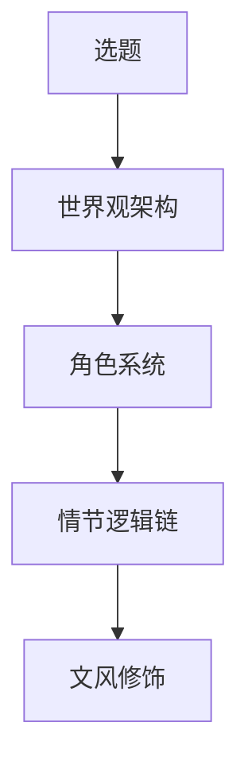
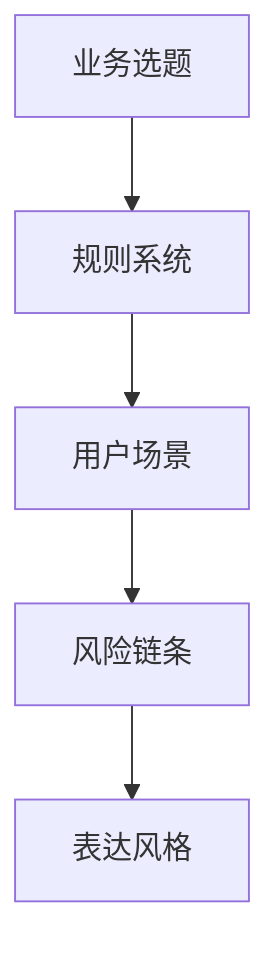

# 从《迟到》创作流程抽取到本书的方法

来源文件：`D:\AIProjects\Downloads\手机库下载\《迟到》创作全流程解析.md`

## 原方法的核心

《迟到》方法文件给出的不是“写作技巧”，而是一个创作工程模型：

对应到非虚构业务书，本书改写为：

## 本书的五层结构

| 原模型 | 本书对应 | 执行要求 |
|---|---|---|
| 选题 | 新疆家长志愿风险识别 | 先解决“别填错”，不写泛百科 |
| 世界观架构 | 志愿填报规则系统 | 官方政策、招生计划、招生章程、位次数据、家庭偏好必须分层 |
| 角色系统 | 家长、学生、规划师、AI、学校、官方文件 | 每个角色有边界：AI 不拍板，家长签字，规划师复核 |
| 情节逻辑链 | 错误如何发生 | 信息缺失 → AI 初筛误判 → 未复核 → 退档/滑档/调剂后悔 |
| 文风修饰 | Rex 式直白判断 | 短句、清单、案例、红线，不写空泛鸡汤 |

## 时间分配

沿用源文件的比例，但换成本书工作量：

- 基础研究 45%：官方政策、招生规则、章程限制、真实案例风险点。
- 系统思考 35%：风险分层模型、家长决策流程、问路工作台可复用结构。
- 文字产出 10%：章节初稿、案例、清单。
- 格式处理 10%：Markdown、PDF、网页、开源仓库结构。

## AI 边界

AI 可以做：

- 把材料整理成清单。
- 发现字段缺失。
- 生成家长能看懂的解释稿。
- 帮忙做多版本标题、目录、章节初稿。

AI 不该做：

- 替家长决定最终志愿。
- 替官方文件背书。
- 在数据缺失时给强结论。
- 把未经核验的预测写成事实。

## 本书第一质检

1. 家长看完是否能立刻少犯一个硬错。
2. 每个判断是否有可核验来源或明确标注“需复核”。
3. 内容是否服务业务闭环：公开信任、标准品承接、一对一筛选。
4. 有没有泄露核心个性化服务能力：若书稿已经能替代一对一，就写过头了。
