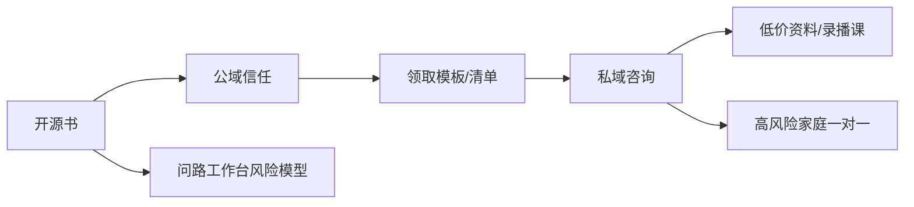

# 选题策划

## 结论

第一本开源书选：**《别把孩子的分数浪费在志愿表里：新疆家长高考志愿风险识别手册》**。

不先写“新疆新高考全流程教程”，也不先写“问分 AI 方法论”。原因很直接：风险识别最容易建立信任，最容易拆内容，最不容易和付费产品打架。

## 候选选题池

| 选题 | 价值 | 致命问题 | 处理 |
|---|---|---|---|
| 新疆家长志愿风险识别手册 | 强获客、强信任、低泄密 | 需要持续官方复核 | 立即写 |
| 新疆新高考 3+1+2 家长扫盲书 | 2027 长期资产 | 现在容易写成课程替代品 | 第二本 |
| 低分段孩子升学路径手册 | 用户痛点强 | 需要更多真实路径数据 | 做专题章 |
| 问路工作台产品白皮书 | 能塑造专业壁垒 | 家长不一定想看产品架构 | 写成内部文档，不做第一本 |
| 问分 AI 提分方法论 | 能服务考前产品 | 和当前志愿季不完全同频 | 后置到考前内容季 |

## 目标读者

- 新疆高三家长，尤其是第一次填志愿、信息焦虑、怕滑档退档的人。
- 高一高二家长，提前理解 2027 新高考的选科和专业限制。
- 想用 AI 查资料，但知道 AI 不能替自己承担录取后果的人。

## 本书不服务谁

- 想买“保录取答案”的家长。
- 不愿提供完整信息，却要求强结论的人。
- 想让 AI 直接给最终志愿表的人。

这三类用户不是书的目标读者，也是业务上要筛掉的人。

## 核心承诺

读完这本书，家长不一定能独立做出最优方案，但应该能做到三件事：

1. 识别哪些错误会造成不可逆损失。
2. 知道动手填报前必须准备哪些材料。
3. 判断什么时候必须找专业人士复核。

## 与业务的关系

## 书名备选

1. 《别把孩子的分数浪费在志愿表里》
2. 《新疆家长高考志愿风险识别手册》
3. 《填志愿前，先排雷》
4. 《新疆高考志愿：家长风险体检书》

建议发布名：**《别把孩子的分数浪费在志愿表里》**。
副标题：**新疆家长高考志愿风险识别手册**。
