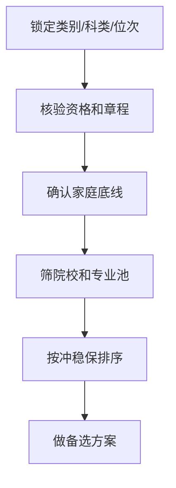
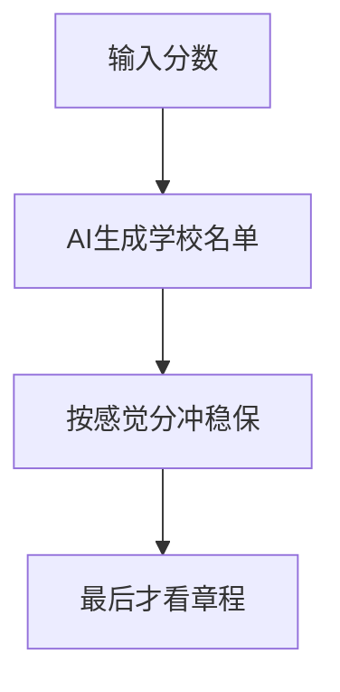
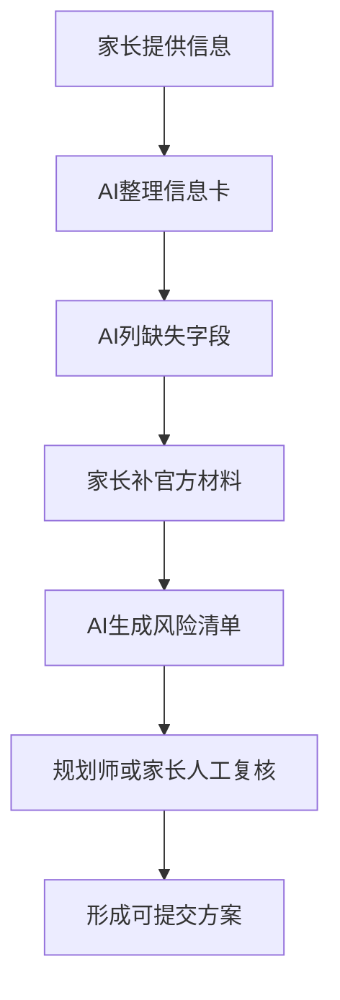

# 别把孩子的分数浪费在志愿表里

副标题：新疆家长高考志愿风险识别手册

作者：黄昊 Rex / 问路

版本：MVP 初稿 2026-06-25

> 免责声明：本书为通用风险识别手册，不构成个性化志愿填报方案，不承诺任何录取结果。政策、批次、时间、招生计划、选科要求、章程限制等，以新疆教育考试院、招生高校和当年官方发布为准。

---

# 前言：这本书只解决一件事

这本书只解决一件事：**别让孩子的分数，死在志愿表里的低级错误上。**

高考分数出来以后，很多家长第一反应是问：“这个分能上什么学校？”

这个问题太早了。

更该先问的是：

- 孩子在哪个类别、哪个科类、哪个位次段里竞争？
- 想报的专业有没有身体、单科、语种、选科限制？
- 冲的学校如果进档后专业不够，会不会被调剂到完全不能接受的方向？
- 这个方案出了问题，是滑档、退档、调剂后悔，还是只是学校层次没用满？
- 哪些判断来自官方文件，哪些只是经验，哪些只是 AI 的初稿？

志愿填报不是一场“猜学校”的游戏。它更像一套带硬约束的匹配系统：先看资格，再看数据，再看风险，最后才谈偏好。

很多家庭不是输在不努力，也不是输在信息少，而是输在顺序错了。

他们先问学校，再补材料；先看分数线，再看位次；先让 AI 出方案，再回头找章程；先决定城市和专业，最后才发现某个限制根本过不去。

这本书不承诺让你“捡漏”。能承诺的是：你读完以后，至少能少犯几类不可逆错误。

## 这本书不是什么

它不是录取预测软件。

它不是学校推荐清单。

它不是“花钱少也能替代一对一”的完整方案。

它也不会告诉你某个分数“一定能上”哪所学校。

原因很简单：志愿填报的后果由考生和家长承担，不由写书的人、短视频博主、AI 工具承担。任何不看完整信息就给强结论的人，都在把你的家庭风险当流量素材。

## 这本书是什么

它是一份风险识别手册。

它帮你把志愿填报拆成五层：

1. 规则层：官方政策、批次、志愿单位、投档录取规则。
2. 资格层：类别、科类、选科、体检、单科、语种、政审、专项资格。
3. 数据层：分数、位次、招生计划、近年录取位次、计划变化。
4. 方案层：冲稳保结构、专业顺序、服从调剂、备选方案。
5. 决策层：孩子想要什么、家长能接受什么、最坏结果能不能承担。

这五层里，前两层错了，后面没有讨论价值。

## 最重要的一句话

**志愿填报的第一目标不是冲高，而是避免不可逆错误。**

冲高失败，还有稳和保。

专业不满意，还有转专业、辅修、考研和就业路径调整。

真正危险的是：资格不符、章程没看、类别弄错、调剂后悔、退档滑档、最后几小时慌乱提交。

这些错误一旦发生，很多不是“再想想”能补救的。

## 怎么使用这本书

如果你是 2026 届家长，先看第一章到第四章，重点是类别、位次、招生章程和填报时间。

如果你是 2027 届及以后家长，第二章和第五章要反复看，尤其是“3+1+2”选科要求和 AI 边界。

如果你已经拿到 AI 生成的志愿表，不要急着用。先按第十章的报告模板做一次风险体检：字段全不全、来源明不明、红线有没有处理。

这本书能帮你把问题问对。真正到具体方案时，仍然要回到官方文件、最新数据和家庭真实取舍。

---

# 第一章：志愿填报的第一性原理

本章结论：**录取不是奖励努力，而是在规则约束下完成匹配。你先把规则、资格、数据、偏好分清楚，再谈学校名单。**

家长最容易犯的第一个错误，是把志愿填报理解成“根据分数找学校”。

这只是表层。

真正的志愿填报至少有四个变量：

- 你有没有资格报。
- 你的位次和数据支不支持报。
- 这个方案失败后的后果能不能接受。
- 这个结果是不是孩子和家庭真的愿意承担。

分数只是入口，不是答案。

## 1. 志愿填报的底层公式

可以把志愿填报写成一个公式：

```text
可提交方案 = 官方规则 × 报考资格 × 数据匹配 × 家庭取舍
```

任何一项为零，方案都不能直接提交。

官方规则错了，方向错。

报考资格错了，可能直接退档或无效。

数据匹配错了，可能滑档或浪费分数。

家庭取舍没谈清楚，可能录取后全家后悔。

## 2. 先排不可逆风险

志愿填报里有两种错误：

一种是结果不完美。

比如学校层次没冲到最好，城市不是最理想，专业没有完全命中。这类错误痛苦，但通常还有后续调整空间。

另一种是不可逆风险。

比如类别填错、资格不符、招生章程限制没看、投档后不服从调剂被退档、最后提交时间错过。这类错误不是“遗憾”，是事故。

所以第一优先级不是“冲更好”，而是先排事故。

## 3. 四层风险顺序

### 第一层：红线风险

红线风险是不能带病进入方案的风险。

典型问题：

- 普通类、单列类等类别没有锁定。
- 文理科或物理/历史方向没有锁定。
- 体检限报没有核验。
- 军警公安、定向、专项资格没有核验。
- 填报时间节点不清楚。

处理方式：暂停推荐，先补材料。

### 第二层：资格风险

资格风险不是分数问题，是“能不能报”的问题。

典型问题：

- 专业限制外语语种。
- 专业限制单科成绩。
- 专业限制身体条件。
- 专业组或院校对选科有要求。
- 特殊类型招生有政审、面试、体检、体测要求。

处理方式：逐条查招生章程和官方通知。

### 第三层：数据风险

数据风险是“报了以后概率是否合理”的问题。

典型问题：

- 只看分数，不看位次。
- 只看去年一年，不看多年份变化。
- 不看招生计划变化。
- 用短视频截图、群聊表格代替官方数据。
- 把 AI 编出来的数据当证据。

处理方式：保留数据来源，尽量用官方和可追溯材料。

### 第四层：偏好风险

偏好风险是“录上以后能不能接受”的问题。

典型问题：

- 家长想要学校，孩子想要专业。
- 家长想留疆，孩子想出疆。
- 冲学校时没看可能被调剂到什么专业。
- 只听亲戚建议，没问孩子底线。

处理方式：开家庭决策会，把最坏结果说清楚。

## 4. “能报”“该报”“敢报”不是一回事

家长要把三个问题分开。

**能报**：规则和资格允许。

**该报**：数据上有合理支撑，符合孩子方向。

**敢报**：失败后的结果能承担。

很多争吵来自把这三个问题混成一个问题。

一个学校能报，不代表该报。

一个专业该报，不代表敢把它放在冲的位置。

一个方案 AI 能生成，不代表家长敢签字。

## 5. 家长先做一张风险表

在列学校之前，先列风险表：

| 问题 | 当前状态 | 风险等级 | 下一步 |
|---|---|---|---|
| 类别/科类是否锁定 | 未确认 | 红线 | 先核对报名和成绩信息 |
| 位次是否准确 | 已有 | 低 | 进入数据匹配 |
| 体检限制是否核验 | 未核验 | 红线 | 查章程和体检要求 |
| 服从调剂能否接受 | 家庭未讨论 | 高 | 开决策会 |
| 数据来源是否可靠 | 群聊截图 | 高 | 换官方来源 |

这张表比学校清单更重要。

学校清单可以改，红线错误不能带进系统。

## 本章自查

- [ ] 我有没有把“能报、该报、敢报”分开？
- [ ] 我有没有先排红线，而不是先列学校？
- [ ] 每个关键判断有没有来源？
- [ ] 最坏结果孩子和家长是否讨论过？
- [ ] AI 生成内容有没有人工复核？

---

# 第二章：新疆家长的第一道锁：类别、科类、位次

本章结论：**新疆家长填志愿，第一步不是选学校，而是锁定赛道。类别、科类、位次没锁定，后面所有推荐都不可信。**

很多家庭一上来就问：“这个分能不能上某某大学？”

先别问。

更要命的问题是：这个分在哪条赛道里比较？

同样的分数，普通类和单列类不是一回事；文科和理科不是一回事；2027 年以后，物理方向和历史方向也不是一回事；有专项资格和没有专项资格也不是一回事。

赛道错了，学校名单越长，误导越大。

## 1. 为什么先锁赛道

高考志愿不是全疆所有考生放在一个池子里排队。

考生会被规则分到不同比较口径里：类别、科类、批次、专项资格、选科要求、招生计划，都会影响能报什么、和谁竞争、怎么投档。

所以第一道问题不是“孩子多少分”，而是：

```text
孩子属于哪一类考生？在哪个科类或选科方向？对应的位次是多少？能进入哪些招生计划池？
```

这句话家长一开始听着麻烦，但它能挡住大量低级错误。

## 2. 2026 届家长先看这些字段

2026 年新疆志愿填报仍要严格回到当年官方发布的招生规定、招生计划和志愿填报系统。根据新疆教育考试院 2026-06-24 通知，自治区 2026 年普通高考网上志愿填报系统于 2026-06-25 12:00 开通，本科提前批截止 2026-07-01 12:00，其他批次截止 2026-07-03 12:00。

位次不要用第三方表硬凑。新疆教育考试院 2026-06-22 成绩查询通知明确，考生可通过官方渠道查询本人高考成绩和位次。个案方案里，官方成绩/位次截图比网上流传的一分一段截图更硬。

家长要先锁这些字段：

- 普通类 / 单列类 / 其他类别。
- 文科 / 理科。
- 分数。
- 官方查询到的全区位次。
- 批次资格。
- 专项、定向、预科等特殊资格。
- 体检、政审、面试、体测等特殊要求。

不要只发一个分数给别人问学校。

只给分数，对方要么只能说废话，要么只能瞎猜。

## 3. 2027 届及以后家长要提前看选科

新疆教育考试院已发布 2027 年拟在新疆招生的普通高校招生专业选考科目要求。官方公告明确，2027 年新疆普通高考实行“3+1+2”模式：语文、数学、外语为统考科目；物理或历史选 1 门作为首选科目；化学、生物、思想政治、地理选 2 门作为再选科目。

这意味着：2027 届及以后，志愿填报前的很多限制，早在选科阶段就已经埋下了。

家长要提前问：

- 孩子的首选科目是物理还是历史？
- 目标专业是否要求物理？
- 是否要求化学？
- 是否同时要求物理和化学？
- 这个专业当年是否真的在新疆投放计划？

最后一句尤其重要：选考科目要求表里出现，不代表当年一定在新疆招生。实际招生专业计划以当年公布为准。

## 4. 位次比分数更稳定

分数会被试卷难度影响。

同样 500 分，年份不同，含义可能完全不同。

位次更接近真实竞争位置。家长要做的是用位次看院校和专业的历史录取范围，而不是拿今年分数硬套去年分数线。

正确问法：

```text
孩子今年在对应类别和科类里的位次是多少？目标院校近几年在同类别同科类的录取位次区间是多少？今年招生计划有没有变化？
```

错误问法：

```text
去年这个学校最低分 480，我家今年 490，是不是稳？
```

这个问法危险，因为它忽略了位次、计划、大小年、类别和专业限制。

## 5. 单列、专项、预科不要靠口口相传

新疆家长经常会遇到单列类、南疆专项、预科、定向、公费师范、医学定向等特殊路径。

这类机会确实重要，但不能靠亲戚、群聊、短视频判断资格。

每一个特殊路径都要问三件事：

1. 我有没有资格报？
2. 报了以后有什么义务或限制？
3. 录取后不满意能不能退、能不能转、会不会影响后续批次？

资格不清楚，就不要让 AI 或任何人直接出最终方案。

## 6. 第一张表：赛道锁定表

填学校前，先填这张表。

| 字段 | 家长填写 | 是否已核验 | 证据来源 |
|---|---|---|---|
| 考生类别 |  |  |  |
| 科类/首选科目 |  |  |  |
| 分数 |  |  |  |
| 位次 |  |  |  |
| 批次资格 |  |  |  |
| 专项资格 |  |  |  |
| 体检/政审/面试/体测 |  |  |  |
| 是否涉及定向或服务义务 |  |  |  |

这张表没填完，不进入学校推荐。

## 本章自查

- [ ] 我是否已经锁定孩子类别？
- [ ] 我是否已经锁定科类或首选科目？
- [ ] 我是否有准确位次，而不是只有分数？
- [ ] 我是否确认目标路径的资格要求？
- [ ] 我是否知道所有时间节点以官方发布为准？

---

# 第三章：冲稳保不是万能药

本章结论：**冲稳保只是排序方法，不是风险控制系统。真正的风险控制，要先排红线、资格和数据，再谈冲稳保比例。**

家长最爱问：“冲几个、稳几个、保几个？”

这个问题有用，但不是第一个问题。

如果类别错了，冲稳保没意义。

如果章程限制没看，冲稳保没意义。

如果全靠去年分数线，冲稳保只是心理安慰。

如果冲进去后调剂到完全不能接受的专业，所谓“冲成功”也可能变成后悔。

## 1. 冲稳保到底是什么

冲稳保的本质是把志愿按风险从高到低排列。

- 冲：有机会，但不确定性高。
- 稳：匹配度较高，风险相对可控。
- 保：用于兜底，优先保证不滑档。
- 垫：更保守的安全位，防止极端情况。

它解决的是“顺序和梯度”问题。

它不解决“资格是否符合”问题。

## 2. 家长对冲稳保最大的误解

### 误解一：比例固定

不存在万能比例。

冲稳保比例取决于孩子位次、批次、可接受专业范围、家庭风险承受、是否有明确底线。

一个专业执念很强的孩子，不能和“学校优先、专业可调”的孩子用同一套比例。

### 误解二：冲就是冲学校

冲学校不等于冲好结果。

如果冲进学校后只能去完全不接受的专业，结果未必好。

要问的是：冲进去以后的最差专业，孩子能不能接受。

### 误解三：保底就是随便放几个低学校

保底不是“低分学校随便填”。

保底也要看专业、城市、学费、就业、升学、家庭接受度。

一个孩子绝对不能接受的保底学校，不是真保底，只是表格里的占位。

## 3. 先做风险体检，再排梯度

正确顺序：



错误顺序：



错误顺序看着快，实际上最容易在最后一天爆雷。

## 4. 冲的前提

可以冲，但要满足四个条件：

1. 资格确定符合。
2. 数据上不是纯幻想。
3. 进档后的专业结果能接受。
4. 失败后有稳和保接住。

少一个，就不是“冲”，是赌。

## 5. 稳的标准

稳不是“去年分数够”。

稳至少要看：

- 对应类别和科类的近年位次。
- 招生计划是否明显变化。
- 目标专业是否热门或收分波动大。
- 是否存在章程限制。
- 家庭是否接受该校该专业的现实结果。

稳的核心不是好听，而是可解释。

你要能说清楚为什么它稳。

## 6. 保的底线

保底要解决最坏情况。

一个合格保底至少满足：

- 录取概率相对高。
- 专业或专业范围能接受。
- 学费和地域能接受。
- 不会因为资格问题出错。
- 家庭提前知道这是兜底，不是失败羞辱。

很多家庭不愿认真做保底，因为觉得“不吉利”。

这是危险心理。

保底不是认输，是给孩子留路。

## 7. 冲稳保表格

| 层级 | 学校/专业 | 数据依据 | 最坏结果 | 能否接受 | 需要复核 |
|---|---|---|---|---|---|
| 冲 |  |  |  |  |  |
| 稳 |  |  |  |  |  |
| 保 |  |  |  |  |  |
| 垫 |  |  |  |  |  |

如果“最坏结果”这一列写不出来，就不要急着提交。

## 本章自查

- [ ] 我有没有先排红线，再排冲稳保？
- [ ] 每个冲的志愿，最坏专业能不能接受？
- [ ] 保底是不是全家都认可的真保底？
- [ ] 稳的依据是不是位次和计划，不是去年分数？
- [ ] 是否准备了方案 B？

---

# 第四章：招生章程才是硬门槛

本章结论：**招生计划告诉你有没有名额，招生章程告诉你有没有资格。家长不看章程，就等于闭眼签风险。**

很多家长愿意花几个小时看学校排名，却不愿花十分钟看招生章程。

这是志愿填报里最亏的时间分配。

学校排名影响的是好不好，招生章程影响的是能不能。

能不能，比好不好更靠前。

## 1. 招生计划和招生章程不是一回事

招生计划回答：今年这个学校在新疆招不招，招几个，在哪个批次，招哪些专业。

招生章程回答：这个学校怎么录取，有哪些限制，进档后怎么分专业，哪些情况可能退档。

你只看计划，不看章程，就像只看菜单不看过敏原。

## 2. 章程里最该看的六类限制

### 身体条件

医学、公安、军警、航海、飞行、部分工科、体育艺术等方向，可能有视力、色觉、身高、体重、体检结论等要求。

家长不能只问“孩子分够不够”，还要问“孩子身体条件符不符合”。

### 单科成绩

有些专业可能对数学、英语、语文等单科成绩有要求。

总分够，不代表单科够。

### 外语语种

有些专业对外语语种有要求，或者入学后公共外语教学语种有限制。

如果孩子不是英语语种，必须重点看。

### 选科要求

2027 年及以后尤其重要。专业要求物理、化学、生物等科目时，孩子选科不符合，就不能报。

### 专业录取规则

进档以后怎么分专业，是分数优先、专业优先、专业级差，还是其他规则？

这会影响专业排序和服从调剂风险。

### 特殊类型要求

军队、公安、消防、定向、公费师范、免费医学、专项计划等，可能涉及政审、面试、体检、体测、服务年限、违约责任。

这些不是普通学校偏好，是硬要求。

## 3. 家长要警惕“看起来能报”

最危险的是“看起来能报”。

分数够，看起来能报。

学校名字合适，看起来能报。

专业名字喜欢，看起来能报。

群里有人说去年能上，看起来能报。

只要章程限制没核验，这些都只是感觉。

## 4. 章程核验清单

每个目标学校至少问这 10 个问题：

- [ ] 今年是否在新疆有招生计划？
- [ ] 招的是哪个类别、哪个科类或选科方向？
- [ ] 目标专业是否在新疆招生？
- [ ] 是否有体检限制？
- [ ] 是否有单科成绩要求？
- [ ] 是否有外语语种要求？
- [ ] 是否有男女比例、身高、视力等限制？
- [ ] 进档后按什么规则分专业？
- [ ] 服从调剂的范围是什么？
- [ ] 是否有服务年限、定向就业、违约责任？

这 10 个问题没有答案，不要把学校放进最终表。

## 5. 服从调剂必须看范围

家长常问：“要不要服从调剂？”

这个问题不能抽象回答。

你必须先知道调剂范围。

在不同规则下，调剂可能发生在院校内，也可能发生在专业组内。具体怎么调，以当年本地志愿设置和学校章程为准。

正确做法是：把该院校或专业组里所有可能被调剂到的专业列出来，逐个标注能不能接受。

如果有一堆绝对不能接受的专业，就不能只因为学校名气好而盲目服从。

## 6. 章程证据表

| 学校 | 专业 | 限制项 | 章程原文位置 | 是否符合 | 处理 |
|---|---|---|---|---|---|
|  |  | 体检 |  |  |  |
|  |  | 单科 |  |  |  |
|  |  | 外语 |  |  |  |
|  |  | 选科 |  |  |  |
|  |  | 调剂 |  |  |  |

这张表很笨，但有效。

志愿填报不是靠聪明赢，是靠少犯硬错赢。

## 7. 六个已经做过的章程样例

本书附录 A 放了六个 2026 年章程核验样例：石河子大学、新疆师范大学、新疆大学、新疆医科大学、昌吉学院、郑州大学。

这些样例能说明一件事：章程风险不是抽象概念，它会落在很具体的条款上。

- 石河子大学样例里，英语语种、软件工程 NIIT 班、色弱色盲、调剂到未完成计划专业，都需要单独核验。
- 新疆师范大学样例里，师范类职业适配、英语和翻译语种、航空服务艺术与管理身体条件、数学单科要求，都不能只看总分。
- 新疆大学样例里，校区、设计学类统考资格、软件工程收费、调剂退档，都要提前确认。
- 新疆医科大学样例里，法医学、护理、哈医学、维医学、色盲色弱、外语公共课，都可能影响报考。
- 昌吉学院样例里，英语和商务英语单科要求、航空相关专业身体条件、4+0 应用本科培养地点，都要单独标注。
- 郑州大学样例里，南疆单列、哈密和和田定向招生、色觉限制、中外合作办学费用和外语授课，都要单独核验。

家长不要只问“这个学校怎么样”。

先问这四句：

1. 这个专业在新疆今年有没有计划？
2. 这个孩子的类别、科类、语种、体检、单科是否匹配？
3. 进档后按什么规则分专业？
4. 服从调剂会被调到哪里，不服从会发生什么？

四句答不清，学校先不进最终表。

## 本章自查

- [ ] 我是否逐校看过招生章程？
- [ ] 我是否知道每个目标专业的限制？
- [ ] 服从调剂范围是否说得清楚？
- [ ] 特殊类型是否完成官方资格核验？
- [ ] 章程证据是否留存截图或链接？

---

# 第五章：AI 能帮你什么，不能替你做什么

本章结论：**AI 是整理材料的助手，不是替家庭承担后果的裁判。用 AI 查漏可以，用 AI 拍板危险。**

现在很多家长会把分数、位次、想去的城市丢给 AI，让它生成志愿表。

这一步可以作为初筛，但不能作为最终方案。

原因不复杂：AI 不承担录取后果，家长承担。

## 1. AI 最适合做什么

### 整理信息

AI 可以把家长零散描述整理成结构化信息卡。

比如：类别、科类、分数、位次、目标城市、专业偏好、排除专业、特殊资格、风险承受。

### 查漏

AI 可以提醒家长还缺哪些信息。

比如：没有位次、没有类别、没有招生章程、没有体检结论、没有明确调剂底线。

### 生成核验清单

AI 可以帮你列出要查的材料：官方成绩/位次截图、招生计划、招生章程、一分一段公开表、近年录取数据、专项资格通知。

### 解释复杂概念

AI 可以把“平行志愿”“位次”“服从调剂”“院校专业组”“等级赋分”翻译成家长能理解的话。

### 生成初步方案

AI 可以基于你提供的数据生成初稿，供人工复核。

注意，是初稿。

## 2. AI 不适合做什么

### 不适合编数据

如果你没给官方数据，AI 可能会补全一个看起来像真的答案。

这不是能力，是风险。

### 不适合替你判断资格

体检、政审、单科、语种、专项资格，必须回到官方文件和学校章程。

AI 可以提示你查，不能替官方确认。

### 不适合替家庭做取舍

孩子能不能接受出疆，家长能不能接受调剂到冷门专业，家庭能不能承担民办学费，这些不是算法问题。

这是家庭决策。

### 不适合给强承诺

任何“稳上”“必录”“放心填”的 AI 结论，都要降级处理。

你需要的是证据，不是安慰。

## 3. 正确的 AI 使用流程



不要跳过 D 和 F。

这两个环节才是真正决定风险的地方。

## 4. 给 AI 的安全提示词

你可以这样问 AI：

```text
请不要直接推荐学校。先根据我提供的信息，列出志愿填报前必须核验的字段。凡是信息不足的地方，只标注“需补充”，不要给强结论。
```

你也可以这样问：

```text
请把这份志愿草表做风险体检，按红线、高风险、中风险、低风险分层。重点检查类别、科类、位次、招生章程、体检限制、单科要求、外语语种、服从调剂和备选方案。没有证据的地方标注“需人工复核”。
```

不要这样问：

```text
我家孩子 XXX 分，帮我直接填一份最稳的志愿表。
```

这个问法会诱导 AI 给你一个看似完整、实际缺证据的答案。

## 5. AI 输出要分级

AI 输出分三种：

| 类型 | 能不能直接用 | 处理方式 |
|---|---|---|
| 材料整理 | 可以作为草稿 | 人工核对字段 |
| 风险提示 | 可以参考 | 回到官方文件验证 |
| 最终方案 | 不能直接用 | 必须人工复核和家长确认 |

家长要记住：AI 不是不能用，AI 是不能越权用。

## 6. 问路工作台的原则

如果把 AI 放进专业服务里，最稳的结构不是“AI 推荐学校”，而是“AI 做风险体检”。

正确分工：

- AI：整理信息、发现缺口、生成草案、解释概念。
- 规则引擎：判断硬性条件，如类别、体检、选科、单科、语种。
- 规划师：复核风险、解释取舍、给出建议。
- 家长和考生：最终确认和签字。

这才是可靠路径。

## 本章自查

- [ ] 我有没有让 AI 直接拍板？
- [ ] AI 输出的数据是否能追溯到官方来源？
- [ ] AI 是否标注了信息不足的地方？
- [ ] 体检、章程、专项资格是否人工复核？
- [ ] 家庭取舍是否由人来决定？

---

# 第六章：家长决策会怎么开

本章结论：**志愿填报不是家长替孩子做选择，也不是孩子凭感觉任性选。必须开一次家庭决策会，把底线、偏好和最坏结果说透。**

很多志愿冲突，不是信息不够，而是家庭内部没把话说开。

父母想要稳定，孩子想要城市。

父母想要学校名气，孩子想要专业兴趣。

父母怕出疆，孩子想出去看看。

这些冲突不提前谈，最终会在填报当天爆炸。

## 1. 决策会只解决三个问题

不要把家庭决策会开成情绪大会。

只解决三个问题：

1. 最想要什么。
2. 最不能接受什么。
3. 最坏结果能不能承担。

这三个问题比“哪个学校更好”更重要。

## 2. 先列底线，不要先列梦想

梦想可以很多，底线必须清楚。

先问孩子：

- 哪些城市绝对不能接受？
- 哪些专业绝对不能接受？
- 能不能接受调剂？能接受到什么范围？
- 能不能接受复读？
- 民办本科、高职专科、职业本科能不能接受？

再问家长：

- 学费上限是多少？
- 出疆能不能接受？
- 孩子独立生活能力够不够？
- 家庭更看重学校、专业、城市还是就业稳定？
- 最差录取结果能不能接受？

底线不清楚，志愿表就是家庭矛盾的延迟爆发。

## 3. 把四个变量分开打分

每个候选方案都可以按四个变量打分：

| 变量 | 问题 | 分值 |
|---|---|---|
| 学校 | 平台和认可度是否可接受 | 1-5 |
| 专业 | 课程、就业、升学是否可接受 | 1-5 |
| 城市 | 距离、资源、生活成本是否可接受 | 1-5 |
| 风险 | 滑档、退档、调剂后悔概率是否可控 | 1-5 |

不要只看总分。

如果某一项是零分，这个方案就要慎重。

比如专业绝对不能接受，就算学校和城市都好，也可能不是好结果。

## 4. 冲突怎么处理

### 家长要学校，孩子要专业

先问：孩子要的专业是不是经过真实了解，还是只被名字吸引？

如果孩子只是觉得专业名字好听，先查课程和就业。

如果孩子确实有长期兴趣和能力，家长不能只用学校名气压过去。

### 家长想留疆，孩子想出疆

先问：出疆是为了更好的学校专业，还是只是逃离家庭控制？

如果是前者，讨论成本、距离和适应能力。

如果是后者，志愿表解决不了家庭关系问题。

### 家长想稳，孩子想冲

先问：冲失败后的方案，孩子能不能接受。

只要稳和保能接住，适度冲可以讨论。

如果孩子只要冲、不接受任何兜底，那不是志愿策略，是情绪下注。

## 5. 决策会流程

建议 60 分钟，按这个顺序：

1. 10 分钟：确认类别、位次、可选范围。
2. 10 分钟：孩子说专业、城市、学校偏好。
3. 10 分钟：家长说预算、地域、安全、就业顾虑。
4. 15 分钟：逐条列不能接受的结果。
5. 10 分钟：确定冲稳保策略和保底底线。
6. 5 分钟：确认谁负责查章程、谁负责录入、谁负责最终核对。

会议结束必须有记录。

没有记录，就等于没开。

## 6. 家庭确认表

| 问题 | 家长意见 | 孩子意见 | 最终确认 |
|---|---|---|---|
| 是否接受出疆 |  |  |  |
| 是否接受调剂 |  |  |  |
| 不能接受专业 |  |  |  |
| 学费上限 |  |  |  |
| 保底学校底线 |  |  |  |
| 是否接受复读 |  |  |  |
| 最终签字人 |  |  |  |

这张表不是形式主义。

它能避免录取后互相指责。

## 本章自查

- [ ] 孩子是否参与决策？
- [ ] 家长是否明确预算和地域底线？
- [ ] 不可接受专业是否列清楚？
- [ ] 调剂底线是否说清楚？
- [ ] 决策会是否留下记录？

---

# 第七章：低分段不是没路，是不能乱押

本章结论：**低分段最怕的不是学校少，而是路径判断错。别只问“有没有本科”，先判断孩子适合升学、就业、复读还是技能路线。**

低分段家庭最容易被两个情绪拖走。

一个是羞耻感：觉得只要不是本科，就没有出路。

一个是侥幸感：觉得最后总能捡到一个本科，先冲了再说。

这两种情绪都会误伤孩子。

低分段不是没有路。真正的问题是：路更窄，试错成本更高，不能乱押。

## 1. 先把“本科执念”放下来

家长问“有没有本科”可以理解。

本科确实有门槛价值：就业筛选、考公考编、考研、社会认知，都可能受学历层次影响。

问题在于：本科不是唯一变量。

如果为了“有本科”进入一个学费高、专业弱、城市不适合、孩子完全不认可的结果，这不是胜利。

低分段更应该问：

- 这个路径能不能读完？
- 这个专业有没有清晰就业出口？
- 家庭能不能承担学费和生活成本？
- 孩子有没有继续学习的意愿？
- 如果录取结果不理想，有没有下一步方案？

本科只是路径之一，不是所有问题的答案。

## 2. 低分段的四条主路径

### 路径一：能冲本科，但必须接受代价

如果孩子接近本科线或有可用的特殊路径，可以评估本科机会。

重点不是“能不能冲”，而是冲进去以后的代价：

- 专业是否可接受。
- 学费是否可承受。
- 城市和学校管理是否适合孩子。
- 调剂后最差专业能不能接受。
- 是否还有保底路径接住。

冲本科不是错。错的是只看“本科”两个字，不看后面的四年。

### 路径二：优先选择强专科和可就业专业

专科不是一个整体。

有的专科专业就业出口清楚，有校企合作、实训条件、行业准入路径；有的专业名字好听，实际出口模糊。

家长要看：

- 专业对应的岗位是什么。
- 是否需要职业资格证。
- 学校实训条件和就业地区如何。
- 后续是否可以专升本。
- 孩子是否能接受技能训练和实操强度。

低分段孩子如果学习动力一般，选择一个现实出口清楚的专业，可能比硬挤一个弱本科更稳。

### 路径三：职本贯通、专升本、单招等阶段性路径

有些孩子不是不能学，是高中三年没进入状态。

这类孩子可以考虑阶段性路径：先进入一个相对适合的专科或职业本科路径，再通过专升本、技能证书、就业表现往上走。

这里不能空喊“以后还能升”。

必须问清楚：

- 这个地区、这个学校、这个专业的升学通道是什么。
- 专升本需要什么成绩和考试。
- 孩子是否有能力坚持到下一次筛选。
- 家庭是否愿意继续投入时间和费用。

没有执行能力的“以后再升”，只是安慰。

### 路径四：复读

复读不是失败者选项，也不是万能解药。

适合复读的孩子通常有三个特征：

- 这次失利有明确原因，而不是长期基础薄弱。
- 孩子本人愿意，不是家长逼。
- 能拿出下一年具体提分计划。

不适合复读的情况：

- 孩子已经厌学。
- 家庭只想用复读逃避当下选择。
- 没有学科诊断，只说“再努力一年”。
- 心理状态和身体状态承受不了。

复读要有验证机制：哪几科提、每科提多少、用什么方法、多久复盘一次。

没有这个机制，不建议复读。

## 3. 低分段最危险的三类坑

### 坑一：被“低分上本科”话术带走

低分上本科不是不能发生，问题是代价是什么。

家长要问：

- 学校性质是什么？
- 学费多少？
- 专业是什么？
- 毕业出口是什么？
- 是正常录取还是机构包装？
- 是否存在虚假宣传或违规承诺？

凡是绕开官方渠道、承诺内部名额、承诺录取结果的，都直接排除。

### 坑二：只看专业名字

低分段家长更容易被专业名字吸引。

“人工智能”“大数据”“医学技术”“航空服务”“城市轨道”听起来都好。

关键不是名字，是课程、证书、实训、就业岗位和地区需求。

每个专业必须查四件事：学什么、练什么、考什么证、去哪里工作。

### 坑三：把孩子推到不适合的管理环境

有的孩子适合管得严的学校，有的孩子需要更强自主性。

低分段不能只看学校名，还要看管理方式、校区位置、宿舍条件、实训强度、实习安排。

孩子读不下去，路径再漂亮也没用。

## 4. 低分段决策表

| 路径 | 适合条件 | 最大风险 | 必须核验 |
|---|---|---|---|
| 冲本科 | 接近线、有可接受专业、家庭能承担成本 | 调剂后悔、学费压力 | 学校性质、专业、学费、章程 |
| 强专科 | 更重就业技能、愿意实操 | 专业出口不清 | 实训、证书、就业、专升本 |
| 职本/专升本路径 | 愿意阶段性上升 | 后续执行力不足 | 升学通道、考试要求 |
| 复读 | 有明确失利原因和提分空间 | 再次低效一年 | 学科诊断、复盘机制 |
| 直接就业/技能培训 | 学习意愿低、家庭急需现实路径 | 平台低、成长慢 | 行业、证书、合同、风险 |

## 5. 给低分段家长的一句话

低分段最该做的不是找奇迹，而是减少二次伤害。

不要用一个“看起来体面”的录取结果，把孩子推进四年痛苦。

也不要因为一时失落，放弃所有长期路径。

把孩子的真实状态、家庭承受能力、专业出口、升学通道摊开看，能走的路会更清楚。

## 本章自查

- [ ] 我是否只盯着“有没有本科”？
- [ ] 我是否查过专业的真实课程和就业岗位？
- [ ] 我是否能承担目标路径的学费和生活成本？
- [ ] 如果选择复读，是否有明确提分计划？
- [ ] 孩子本人是否认可这个路径？

---

# 第八章：专项场景不能套通用模板

本章结论：**军警公安、定向培养军士、医学定向、公费师范、南疆专项、预科、艺术体育等场景，都不能套普通批模板。先核资格和义务，再谈分数。**

有些志愿不是普通选择，而是带条件的选择。

它可能要求政审、面试、体检、体测。

它可能有服务年限、就业面向、违约责任。

它可能影响后续批次。

这类志愿最怕家长只看“分数够不够”和“毕业有没有编”。

如果资格、义务和后果没看清，就容易把机会填成坑。

## 1. 专项场景的共同特点

这些场景通常有四个共同点：

1. 信息来源必须官方。
2. 报考条件比普通批更多。
3. 时间节点更密集。
4. 录取后的责任更重。

普通批志愿主要看学校、专业、位次和章程。

专项场景还要看资格、公示、体检、政审、面试、服务协议、违约责任。

所以不能直接把普通批的冲稳保方法搬过去。

## 2. 军队院校

军队院校不是“分够就能填”。

根据新疆教育考试院 2026 年军队院校招生通知，相关考生需要关注政治考核、军检、面试、体格检查、心理测试等流程。通知中还明确，达到相关条件的考生依托自治区普通高校招生网上填报志愿系统填报军队院校提前批次志愿，后续按男女生和文理科等口径划定面试体检控制分数线。

家长要核验：

- 是否符合报考基础条件。
- 外语科目要求是否符合。
- 政治考核是否完成。
- 军检时间和地点是否清楚。
- 体检、心理测试、面试材料是否准备齐。
- 未按时参加相关环节的后果是什么。

军队院校不能用“普通本科冲一冲”的心态填。

## 3. 公安院校公安专业

公安院校也不是普通专业。

新疆教育考试院 2026 年公安院校招生通知明确，公安院校会在公安专业学生入学后组织复查，复查不合格会取消入学资格。

这意味着：即使录取，也不是所有风险都结束。

家长要核验：

- 招生对象和报考条件。
- 考察、面试、体检、体能测评要求。
- 公示名单和合格名单。
- 入学后复查要求。
- 就业面向和培养规则。

公安方向不能只看“将来稳定”。

先看孩子能不能过条件，能不能接受训练和纪律环境。

## 4. 定向培养军士

定向培养军士适合一部分目标明确、愿意走军士路径的孩子。

新疆教育考试院 2026 年定向培养军士工作提示写明，报考考生须为 2026 年参加普通高考的高级中等教育学校毕业生，年龄不超过 20 周岁，未婚，志愿至少服现役满 5 年，政治和身体条件按征集义务兵规定执行。

这里的关键词不是“专科层次”，而是“至少服现役满 5 年”。

家长要核验：

- 年龄是否符合。
- 是否未婚。
- 孩子是否真愿意服现役。
- 政治考核和体格检查是否能完成。
- 志愿填报批次和截止时间是否清楚。
- 家庭是否理解后续义务。

如果孩子只是想“找个学校上”，不要轻易碰定向培养军士。

## 5. 医学定向、公费师范、优师专项

这类路径常被家长理解成“低分机会”或“毕业有保障”。

这种理解太粗。

它们更准确的名称是：带服务义务的培养路径。

家长要核验：

- 是否有户籍、地域、类别、分数、身体等限制。
- 是否需要签协议。
- 服务地在哪里。
- 服务年限多久。
- 违约责任是什么。
- 是否影响考研、转专业、就业选择。

如果家庭只看到“稳定”，没看到“绑定”，判断就不完整。

## 6. 南疆专项、预科、单列等路径

新疆本地家庭特别容易碰到这些路径。

处理原则只有一个：不要靠群聊判断资格。

家长要核验：

- 官方公示名单或资格名单。
- 报考类别和计划类型。
- 是否能兼报普通类或其他计划。
- 投档顺序和录取后果。
- 预科后的培养和转入规则。

2026 年招生工作规定明确提到，报考普通类招生计划的考生只能填报普通类招生计划；报考单列类招生计划的考生既可以填报单列类招生计划，又可以兼报普通类招生计划。具体填报仍要按当年志愿系统和招生计划目录执行。

这类规则不能凭印象。

## 7. 艺术、体育、高职单招

艺术、体育、高职单招也不能套普通批。

以 2026 年新疆高职单招为例，官方通知明确报名对象、报名时间、志愿填报方式、是否服从调剂、考试方式和确认录取流程。拟录取后，考生还要在规定时间内确认录取，点击放弃或未操作都会产生相应后果。

这类路径的关键不是“低分可走”，而是流程不能错。

家长要核验：

- 是否已经完成报名。
- 是否需要专业测试或面试。
- 拟录取后是否要确认。
- 确认后是否还能参加后续录取。
- 放弃或未确认的后果是什么。

## 8. 专项场景核验表

| 场景 | 资格 | 时间节点 | 额外测试 | 服务/义务 | 后果 | 是否适合 |
|---|---|---|---|---|---|---|
| 军队院校 |  |  | 政审/军检/面试 | 军队培养 | 未参加视为放弃等 |  |
| 公安院校 |  |  | 考察/体检/体测/面试 | 公安培养 | 入学复查不合格风险 |  |
| 定向军士 |  |  | 政治考核/体检 | 至少服现役 | 违约或不适应风险 |  |
| 医学定向 |  |  | 体检/协议 | 服务年限 | 违约责任 |  |
| 公费师范 |  |  | 协议 | 服务年限 | 违约责任 |  |
| 南疆专项/预科 |  |  | 资格公示 | 培养规则 | 类别和投档影响 |  |
| 高职单招 |  |  | 面试/综合评价 | 录取确认 | 确认后路径变化 |  |

附录 D 已把军队院校、公安院校、定向培养军士、中国消防救援学院、高职单招做成专项类型核验卡。正式填报时，先按附录 D 逐项过资格、流程、考核结论和后果，再讨论学校排序。

## 本章自查

- [ ] 我是否把专项场景当普通批来填？
- [ ] 是否查到官方通知和资格名单？
- [ ] 是否清楚政审、体检、面试、体测时间？
- [ ] 是否理解服务年限和违约责任？
- [ ] 孩子本人是否接受这条路径的真实生活？

---

# 第九章：填报前 72 小时行动表

本章结论：**最后 72 小时不要再幻想重做人生规划，只做四件事：资料核验、风险排雷、志愿确认、录入留痕。**

填报前最后几天，家长最容易进入混乱状态。

一会儿听亲戚说这个学校好，一会儿刷到短视频说那个专业火，一会儿又被群里的截图吓到。

最后 72 小时，最危险的不是信息少，是信息太杂。

这个阶段不适合大幅摇摆。

该做的是收口。

## 1. T-72 小时：资料归档

先把所有材料放到一个文件夹里。

必须有：

- 成绩和位次截图。
- 考生类别、科类或选科信息。
- 官方招生计划目录或志愿系统内计划信息。
- 目标院校招生章程。
- 一分一段公开表或官方位次查询依据。
- 近年录取数据。
- 体检结论或体检限制核验记录。
- 专项、定向、军警公安等资格材料。
- 家庭决策会记录。

没有材料，就不要说“我记得”。

志愿填报不接受模糊记忆。

## 2. T-60 小时：红线排雷

按红线清单逐项查。

| 红线 | 是否完成 | 证据 |
|---|---|---|
| 类别和科类锁定 |  |  |
| 位次准确 |  |  |
| 招生计划确认 |  |  |
| 招生章程确认 |  |  |
| 体检限制确认 |  |  |
| 单科/语种要求确认 |  |  |
| 专项资格确认 |  |  |
| 调剂底线确认 |  |  |
| 截止时间确认 |  |  |

红线没清掉，不进入最终排序。

## 3. T-48 小时：确定 A/B 两套方案

只做一套方案不够。

至少准备两套：

- A 方案：正常风险承受方案。
- B 方案：更保守方案。

如果孩子分数处在边界，或目标方向存在明显不确定性，可以加 C 方案。

每套方案都要写清楚：

- 核心目标是什么。
- 最大风险是什么。
- 最坏结果是什么。
- 家庭是否接受。

## 4. T-36 小时：做调剂后果检查

把所有“服从调剂”的学校或专业组单独拉出来。

逐项问：

- 可能调到哪些专业？
- 哪些专业绝对不能接受？
- 如果调到最差专业，还读不读？
- 如果不服从调剂，被退档或落选的后果能不能承受？

不要用“应该不会那么倒霉”做决策依据。

志愿填报要看最坏结果。

## 5. T-24 小时：家庭最终确认

最后一天前，家长和孩子必须确认一遍。

确认内容：

- 学校顺序。
- 专业顺序。
- 是否服从调剂。
- 保底是否接受。
- 专项路径是否接受义务。
- 录取后不能反悔的后果。

确认后不要再让无关亲戚加入讨论。

临门一脚的信息污染，常常比信息缺失更危险。

## 6. T-12 小时：系统录入和截图

官方系统填报时，按最终表录入。

操作要求：

- 不熬夜填。
- 不在系统维护时间填。
- 不用陌生设备填。
- 不把密码发给别人。
- 录入一项，核对一项。
- 院校代码、专业代码、批次、科类逐项核对。
- 保存后截图。
- 最终提交后截图。

新疆教育考试院 2026 年志愿填报通知提醒，考生需按招生计划专业目录中的院校代号、名称、批次、科类、专业代号、专业名称和相关要求填报并确认，内容应准确无误。

这句话背后的含义很硬：填错的责任主要在考生自己。

## 7. T-3 小时：停止大改

最后三小时只允许修正明显错误。

可以改：

- 代码录错。
- 批次放错。
- 专业顺序录反。
- 忘记勾选或误勾调剂。
- 官方系统提示错误。

不建议改：

- 因为刷到一个视频临时换专业。
- 因为亲戚一句话推翻保底。
- 因为群聊截图临时全盘重排。
- 因为焦虑把稳妥方案改成全冲。

最后阶段，纪律比灵感重要。

## 8. 提交后做什么

提交后不是结束。

要做：

- 保存最终志愿截图。
- 保存提交成功截图。
- 记录提交时间。
- 关注官方录取进程。
- 关注征集志愿通知。
- 保持手机畅通。

不要做：

- 到处传播孩子完整信息。
- 把准考证、身份证、系统截图发群里。
- 轻信“内部补录”“花钱改志愿”“保录取”。

## 本章自查

- [ ] 所有材料是否集中归档？
- [ ] 红线是否逐项清掉？
- [ ] 是否至少准备 A/B 两套方案？
- [ ] 是否做过调剂后果检查？
- [ ] 是否保存提交截图和时间？

---

# 第十章：一份合格的志愿方案长什么样

本章结论：**合格志愿方案不是一张学校表，而是一套可复核的决策文件。它必须包含依据、风险、备选方案和家长确认。**

很多家长以为，志愿方案就是一排学校和专业。

这太薄了。

一张学校表只能说明“填了什么”，不能说明“为什么这么填”，更不能说明“风险在哪里”。

真正合格的方案，应该让另一个专业人士接手后，也能看懂它的逻辑和证据。

## 1. 合格方案的六个部分

### 第一部分：考生信息卡

必须包含：

- 考生类别。
- 科类或选科方向。
- 分数。
- 位次。
- 批次资格。
- 专项资格。
- 身体条件和限制。
- 家庭偏好和底线。

信息卡是方案地基。

地基不清，方案越漂亮越危险。

### 第二部分：数据依据

必须说明：

- 使用了哪一版招生计划。
- 位次来自官方成绩查询截图，还是公开一分一段表。
- 参考了哪些年份录取数据。
- 哪些数据来自官方。
- 哪些数据只是辅助参考。
- 哪些数据仍需人工复核。

没有数据来源的方案，不合格。

### 第三部分：招生章程核验

每个重点院校和专业都要核验：

- 体检限制。
- 单科要求。
- 外语语种。
- 选科要求。
- 专业录取规则。
- 调剂范围。
- 学费和校区。
- 特殊义务或限制。

章程核验不是锦上添花，是防退档和防后悔的底线动作。

### 第四部分：志愿表

志愿表要包括：

- 批次。
- 院校代码。
- 院校名称。
- 专业代码。
- 专业名称。
- 是否服从调剂。
- 冲稳保垫标签。
- 主要依据。
- 风险等级。

只写学校名，不写代码和专业，不够。

只写冲稳保，不写依据，也不够。

### 第五部分：风险说明

每个高风险项都要写成家长能看懂的话。

比如：

```text
这个志愿的主要风险不是学校够不够，而是进档后可能被调剂到你们明确排斥的专业。如果不能接受该专业范围，就不要只因为学校名气保留它。
```

风险说明要直白。

不要写“请谨慎考虑”这种空话。

### 第六部分：备选方案和确认记录

必须有：

- A 方案。
- B 方案。
- 触发切换条件。
- 家长确认。
- 孩子确认。
- 最终提交截图。

没有备选方案，遇到突发信息就容易乱。

没有确认记录，录取后容易互相甩锅。

## 2. 不合格方案的典型样子

看到下面几类方案，直接降级处理。

### 只有学校名单

没有专业、没有依据、没有风险说明。

这不是方案，是名单。

### 只有 AI 推荐

看起来完整，来源不明，章程没核验。

这不是方案，是初稿。

### 只写“冲稳保”

没有位次依据，没有计划变化，没有调剂后果。

这不是风险控制，是标签装饰。

### 只有家长喜欢

孩子没确认，专业底线没问，出疆留疆没谈。

这不是家庭决策，是单方决定。

### 只有“老师说”

没有官方文件，没有截图，没有链接。

这不是依据，是转述。

## 3. 合格方案模板

| 批次 | 层级 | 院校 | 专业 | 服从调剂 | 数据依据 | 章程风险 | 家庭接受度 | 备注 |
|---|---|---|---|---|---|---|---|---|
|  | 冲 |  |  |  |  |  |  |  |
|  | 稳 |  |  |  |  |  |  |  |
|  | 保 |  |  |  |  |  |  |  |
|  | 垫 |  |  |  |  |  |  |  |

配套风险表：

| 风险 | 等级 | 证据 | 处理动作 | 是否完成 |
|---|---|---|---|---|
| 类别/科类 | 红线 |  |  |  |
| 体检限制 | 红线 |  |  |  |
| 调剂后果 | 高 |  |  |  |
| 数据不确定 | 中 |  |  |  |
| 家庭偏好冲突 | 中 |  |  |  |

配套确认表：

| 确认项 | 家长 | 考生 | 时间 |
|---|---|---|---|
| 志愿顺序 |  |  |  |
| 专业顺序 |  |  |  |
| 调剂选择 |  |  |  |
| 最坏结果 |  |  |  |
| 最终提交 |  |  |  |

## 4. 方案必须带证据附件

合格方案至少要带四类附件：

- 官方政策依据：当年招生工作规定、志愿填报通知、专项招生通知。
- 数据依据：分数线、官方成绩/位次截图、一分一段公开表、招生计划专业目录、近年录取数据来源。
- 章程依据：重点院校和重点专业的招生章程原文链接、截图或归档。
- 家庭确认依据：信息采集卡、风险说明、调剂底线、最终提交截图。

没有附件的方案，后期无法复核。

无法复核的方案，出了问题就只剩争吵。

本书附录 B 已列出当前归档的官方证据，也明确标出公开一分一段表、招生计划专业目录截图、部分高校章程正文仍需补证。公开发布时，缺口要明示，不能装作已经核验完成。

## 5. 方案评估的三个问题

拿到任何志愿方案，只问三个问题：

1. 它的依据在哪里？
2. 它的风险在哪里？
3. 出问题后谁承担？

第一个问题答不上来，说明方案不可信。

第二个问题答不上来，说明方案不完整。

第三个问题答不上来，说明家庭没完成决策。

## 6. Rex/问路的交付标准

如果这本书后续接入问路工作台，建议把交付标准定成这样：

- AI 只生成草案和风险提示。
- 硬规则由规则清单判定。
- 数据来源必须留痕。
- 红线项未处理，不允许出最终方案。
- 每个方案必须有人工复核记录。
- 家长和考生必须确认最坏结果。

这套标准比“推荐更准”更有壁垒。

推荐人人都能做。

让家长少踩硬坑，才是长期信任。

## 本章自查

- [ ] 方案是否有完整信息卡？
- [ ] 数据来源是否可追溯？
- [ ] 每个重点专业是否查过章程？
- [ ] 是否有风险说明和备选方案？
- [ ] 家长和孩子是否完成确认？

---

# 附录 A：招生章程核验表

本附录结论：**招生章程核验不是资料收集，是志愿方案的红线检测。查不到原文、说不清限制、留不下证据，该院校或专业就不能进入最终方案。**

## 1. 使用原则

家长核验招生章程，只抓三类信息：

- 能不能报：类别、科类、选科、体检、语种、单科、性别、身高、视力、色觉等限制。
- 进档后怎么分：专业录取规则、同分排序、加分认可、专业级差、调剂范围。
- 录取后有什么义务：校区、学费、合作办学、定向协议、服务年限、复查要求。

一个学校名气再好，只要红线没查清，就先从方案里拿出去。

## 2. 章程核验 12 问

| 序号 | 核验项 | 必须找到的证据 | 找不到时的处理 |
|---|---|---|---|
| 1 | 学校全称和办学性质 | 学校招生章程正文 | 不用简称做判断 |
| 2 | 在新疆是否有计划 | 自治区招生计划专业目录或官方系统截图 | 不进入最终表 |
| 3 | 对应类别、科类、选科 | 招生计划和章程要求 | 重新匹配赛道 |
| 4 | 目标专业是否招生 | 招生计划专业目录 | 不用往年计划替代 |
| 5 | 体检限制 | 章程体检条款 | 查体检结论后再定 |
| 6 | 外语语种 | 章程语种条款 | 非英语语种单独标红 |
| 7 | 单科成绩 | 章程单科要求 | 单科不明时不拍板 |
| 8 | 专业录取规则 | 分数优先、专业优先、级差等条款 | 重新排序专业 |
| 9 | 调剂范围 | 调剂到哪里、什么条件下退档 | 列出不可接受专业 |
| 10 | 同分排序 | 章程或自治区规则 | 同分密集段重点看 |
| 11 | 学费和校区 | 章程收费、校区说明 | 家庭确认成本 |
| 12 | 特殊义务 | 定向、协议、服务年限、复查 | 让家长和考生签字确认 |

## 3. 可直接复制的风险卡

```text
学校：
专业：
年份：
官方章程链接：
本地证据留存：

红线项：
- 类别/科类/选科：
- 体检：
- 外语语种：
- 单科：
- 性别/身高/视力/色觉：

录取规则：
- 专业录取：
- 同分排序：
- 加分认可：
- 调剂范围：

家庭确认：
- 绝对不能接受的专业：
- 可接受的调剂范围：
- 最坏结果：
- 家长确认：
- 考生确认：
```

## 4. 样例：石河子大学 2026 章程风险卡

来源：[石河子大学 2026 年本专科招生章程](https://zsb.shzu.edu.cn/2026/0530/c14089a232887/page.htm)

本地归档：`evidence/school_charters/shzu_2026_charter.html`

| 章程点 | 家长翻译 | 方案动作 |
|---|---|---|
| 分省招生计划最终以省级招生主管部门公布为准 | 学校宣传页不是最终计划表 | 回到新疆招生计划专业目录 |
| 平行志愿投档调档比例不超过 105% | 进档不等于专业落定 | 继续看专业顺序和调剂 |
| 专业录取不设专业志愿分数级差 | 专业排序不因级差扣分 | 按真实偏好排序 |
| 所有专业志愿无法满足且服从调剂时，调剂到未完成计划专业 | 调剂目标不由家长挑 | 先列不可接受专业 |
| 英语专业只招收英语语种考生 | 非英语语种不能只看总分 | 信息采集卡必须记录语种 |
| 软件工程 NIIT 班有志愿、语种、转专业限制 | 特色班需要单独核验 | 单列高风险项 |
| 部分专业对色弱、色盲有限制 | 体检限制不只发生在医学类 | 查体检结论 |

## 5. 样例：新疆师范大学 2026 章程风险卡

来源：[新疆师范大学 2026 年普通本科招生章程](https://www.xjnu.edu.cn/info/1071/71002.htm)

本地归档：`evidence/school_charters/xjnu_2026_charter.html`

| 章程点 | 家长翻译 | 方案动作 |
|---|---|---|
| 分省招生计划由各省招生主管部门公布 | 学校章程不是最终招生计划 | 回到自治区计划目录 |
| 身体状况不适合教师职业者慎重报考师范类 | 师范类也有职业适配风险 | 师范志愿要问身体和职业底线 |
| 英语、翻译专业只招英语语种考生 | 语种不符会卡住 | 非英语语种标红 |
| 航空服务艺术与管理有身高、视力、色觉、体态、心理等条件 | 特色专业限制集中 | 单独走特殊类型核验 |
| 普通类专业按分数优先、遵循专业志愿，不设专业级差 | 专业顺序仍要按偏好排 | 家庭确认专业排序 |
| 部分数学相关专业有数学单科要求 | 总分够不代表单科够 | 单科成绩进表 |
| 专业志愿无法满足时，服从调剂则调剂，不服从则退档 | 调剂风险和退档风险必须提前选择 | 写进风险说明 |

## 6. 样例：新疆大学 2026 章程风险卡

来源：[新疆大学 2026 年普通本科招生章程](https://gaokao.chsi.com.cn/zsgs/zhangcheng/listVerifedZszc--infoId-7669091710%2Cmethod-view%2CschId-590.dhtml)

本地归档：`evidence/school_charters/xju_2026_chsi_charter.html`

| 章程点 | 家长翻译 | 方案动作 |
|---|---|---|
| 学校分乌鲁木齐校区和喀什校区 | 同一个学校也可能有不同校区 | 校区写进家庭确认 |
| 招生计划及专业以省级招生考试管理部门公布为准 | 章程不能替代新疆招生计划目录 | 回到新疆计划目录 |
| 设计学类需省级美术与设计类统考或联考本科成绩合格 | 艺术类不是只看文化分 | 查专业统考资格 |
| 专业录取不设级差，按投档成绩优先和专业志愿顺序录取 | 专业顺序仍影响录取结果 | 按真实偏好排序 |
| 服从调剂时在未完成计划专业限额内调剂，不服从则退档 | 调剂和退档必须提前选 | 列不可接受专业 |
| 软件工程专业收费高于普通理工类专业 | 学费也是家庭决策变量 | 单独确认成本 |

## 7. 样例：新疆医科大学 2026 章程风险卡

来源：[新疆医科大学 2026 年招生章程](https://gaokao.chsi.com.cn/zsgs/zhangcheng/listVerifedZszc--infoId-7669146336%2Cmethod-view%2CschId-594.dhtml)

本地归档：`evidence/school_charters/xjmu_2026_chsi_charter.html`

| 章程点 | 家长翻译 | 方案动作 |
|---|---|---|
| 按“分数优先，遵循志愿”原则录取 | 总分和专业顺序都要看 | 专业排序要家庭确认 |
| 特殊要求专业除外，服从调剂可调到未完成计划专业 | 医学类调剂不能只看学校名 | 先列不能接受专业 |
| 法医学、护理、哈医学、维医学有志愿和调剂限制 | 有些专业不接收普通调剂 | 单独标红 |
| 色盲、色弱考生多数专业不予录取 | 医学类体检限制强 | 体检结论必须进表 |
| 口腔医学惯用左手考生慎重报考 | 细节限制可能影响长期学习就业 | 做专业适配确认 |
| 外语公共必修课为大学英语 | 非英语语种有学习风险 | 非英语语种单独提醒 |

## 8. 样例：昌吉学院 2026 章程风险卡

来源：[昌吉学院 2026 年普通本科招生章程](https://gaokao.chsi.com.cn/zsgs/zhangcheng/listVerifedZszc--infoId-7667003350%2Cmethod-view%2CschId-686.dhtml)

本地归档：`evidence/school_charters/cjc_2026_chsi_charter.html`

| 章程点 | 家长翻译 | 方案动作 |
|---|---|---|
| 公共外语主要为大学英语，另开大学日语、大学俄语 | 小语种考生不能默认没影响 | 查语种匹配 |
| 英语、商务英语、交通运输有外语单科要求 | 总分够不代表单科够 | 单科成绩进表 |
| 服从调剂则调剂到其他专业，不服从则退档 | 调剂不是只调到喜欢专业 | 先列不可接受专业 |
| 色弱、色盲、颜色识别异常涉及多类专业限制 | 非医学类也有体检红线 | 查体检结论 |
| 航空相关专业有身高、视力、色觉、体态等要求 | 特色专业限制集中 | 单独走特殊专业核验 |
| 4+0 应用本科只招有该专业志愿考生，培养地点在合作院校 | 培养地点和培养模式会影响体验 | 单独确认 |

## 9. 样例：郑州大学 2026 章程风险卡

来源：[郑州大学 2026 年本科招生章程](https://gaokao.chsi.com.cn/zsgs/zhangcheng/listVerifedZszc--method-view%2CschId-361%2CinfoId-7654887735.dhtml)

本地归档：`evidence/school_charters/zzu_2026_chsi_charter.html`

| 章程点 | 家长翻译 | 方案动作 |
|---|---|---|
| 进档后按投档成绩和专业志愿安排专业，不设级差 | 专业顺序仍影响结果 | 按真实偏好排序 |
| 平行志愿普通批次中，体检合格且服从调剂者进档后原则上不退档 | 服从调剂能降低退档风险 | 先确认调剂底线 |
| 专业无法满足时，服从调剂到未完成计划专业，不服从则退档 | 调剂不是调到喜欢专业 | 列不可接受专业 |
| 内地新疆高中班、南疆单列、哈密和和田定向招生有单独规则 | 新疆相关计划不能套普通批逻辑 | 单独核验计划类型 |
| 色弱、色盲和颜色识别异常涉及医学、化学、管理、计算机中外合作等专业限制 | 体检限制跨专业大类 | 查体检结论和专业限制 |
| 中外合作办学部分课程英语授课且收费较高 | 语种和成本都可能成为后悔点 | 单独做语种与费用确认 |

## 10. 反面处理样例

### 新疆大学学校官网通知列表

新疆大学学校官网通知公告页只保存到 2026 章程发布线索，正文跳转微信公众号。

处理：不把通知列表当完整章程引用。正式引用使用阳光高考审核页，或后续补学校官网正文、微信原文 PDF、截图。

### 新疆医科大学学校官网旧页面

搜索结果标题指向 2026 招生章程，打开学校官网页面正文显示 2025 年招生章程。

处理：不把该页面作为 2026 证据。正式引用使用阳光高考审核页。

## 11. 放进最终方案的标准

- 每个重点院校至少有一个官方链接。
- 每个高风险专业至少有一条章程原文证据。
- 每个调剂选择都写清可接受和不可接受范围。
- 每个红线项都有人复核。
- 家长和考生确认过最坏结果。

---

# 附录 B：官方证据清单

本附录结论：**志愿方案的证据必须能回到官方源头。没有官方源头，只能作为线索，不能作为最终判断。**

更新时间：2026-06-25

## 1. 证据分级

| 等级 | 证据类型 | 使用方式 |
|---|---|---|
| A | 新疆教育考试院、招生高校官网、阳光高考等官方原文 | 可作为书稿和方案依据 |
| B | 志愿填报系统内截图、招生计划专业目录截图 | 可作为个案方案依据，需标注截图时间 |
| C | 学校公众号、招生办答复、家长群截图 | 只能作为线索，需回到官方正文核验 |
| D | 第三方网站、短视频、论坛、往年整理表 | 不能作为最终依据 |

证据等级低，不代表信息一定错；它只代表不能把家庭后果压在这条信息上。

## 2. 已归档的自治区官方依据

| 用途 | 官方来源 | 本地归档 |
|---|---|---|
| 2026 各批次最低投档控制分数线 | [新疆2026年普通高校招生各批次最低投档控制分数线确定](https://www.xjzk.gov.cn/c/2026-06-24/495382.shtml) | `evidence/official/xjzk_2026_score_lines.html` |
| 2026 成绩和位次查询通知 | [新疆2026年普通高考成绩拟于6月24日上午12时公布](https://www.xjzk.gov.cn/c/2026-06-22/495340.shtml) | `evidence/official/xjzk_2026_score_query_notice.html` |
| 成绩查询入口 | [成绩查询 - 新疆教育考试院](https://www.xjzk.gov.cn/gnq/cjcx/) | `evidence/official/xjzk_score_query_portal.html` |
| 2026 志愿填报系统开通时间和填报入口 | [新疆2026年普通高考志愿填报系统拟于6月25日上午12时正式开通](https://www.xjzk.gov.cn/c/2026-06-22/495343.shtml) | `evidence/official/xjzk_2026_volunteer_system.html` |
| 志愿填报入口 | [志愿填报 - 新疆教育考试院](https://www.xjzk.gov.cn/gnq/zytb/) | `evidence/official/xjzk_volunteer_portal.html` |
| 2026 招生工作规定 | [新疆维吾尔自治区2026年普通高校招生工作规定](https://www.xjzk.gov.cn/c/2026-05-06/495190.shtml) | `evidence/official/xjzk_2026_admission_rules.html` |
| 2027 选考科目要求 | [关于发布2027年拟在新疆招生的普通高校招生专业选考科目要求的公告](https://www.xjzk.gov.cn/c/2025-03-13/493896.shtml) | `evidence/official/xjzk_2027_subject_requirements.html` |
| 高考综合改革 3+1+2 说明 | [新疆高考综合改革相关政策解读（三）](https://www.xjzk.gov.cn/c/2025-05-27/494152.shtml) | `evidence/official/xjzk_2025_reform_qna_3.html` |
| 2026 军队院校招生 | [关于做好2026年军队院校招收普通高中毕业生工作的通知](https://www.xjzk.gov.cn/c/2026-06-23/495376.shtml) | `evidence/official/xjzk_2026_military_academy.html` |
| 2026 公安院校招生 | [关于做好2026年公安普通高等院校招生工作的通知](https://www.xjzk.gov.cn/c/2026-06-09/495238.shtml) | `evidence/official/xjzk_2026_police_college.html` |
| 2026 定向培养军士 | [新疆2026年招收定向培养军士工作提示](https://www.xjzk.gov.cn/c/2026-06-12/495253.shtml) | `evidence/official/xjzk_2026_nco_training.html` |
| 2026 高职单招 | [自治区2026年普通高职（专科）单独招生相关工作即将开始](https://www.xjzk.gov.cn/c/2026-04-03/495104.shtml) | `evidence/official/xjzk_2026_vocational_single_admission.html` |
| 2026 中国消防救援学院新疆招生入口 | [关于2026年中国消防救援学院招收新疆普通高中毕业生工作的公告](https://www.xjzk.gov.cn/c/2026-06-18/495310.shtml) | `evidence/official/xjzk_2026_fire_rescue_college.html` |
| 2026 中国消防救援学院新疆招生原文 | [新疆消防微信原文](https://mp.weixin.qq.com/s/MwCtJNmoh59fC3mUgGAWiA) | `evidence/official/xj_fire_2026_fire_rescue_wechat.html` |
| 2026 中国消防救援学院招生章程 | [中国消防救援学院2026年招收青年学生章程](https://zs.cfri.edu.cn/content/zs/regulations/1525bac9-4fda-11f1-a258-566fc9ae040a.htm) | `evidence/official/cfri_2026_admission_charter.html` |

## 3. 已归档的高校章程依据

| 学校 | 官方来源 | 当前可用状态 | 本地归档 |
|---|---|---|---|
| 石河子大学 | [石河子大学 2026 年本专科招生章程](https://zsb.shzu.edu.cn/2026/0530/c14089a232887/page.htm) | 可用于章程风险样例 | `evidence/school_charters/shzu_2026_charter.html` |
| 新疆师范大学 | [新疆师范大学 2026 年普通本科招生章程](https://www.xjnu.edu.cn/info/1071/71002.htm) | 可用于章程风险样例 | `evidence/school_charters/xjnu_2026_charter.html` |
| 新疆大学 | [新疆大学 2026 年普通本科招生章程](https://gaokao.chsi.com.cn/zsgs/zhangcheng/listVerifedZszc--infoId-7669091710%2Cmethod-view%2CschId-590.dhtml) | 阳光高考审核页，可用于章程风险样例 | `evidence/school_charters/xju_2026_chsi_charter.html` |
| 新疆医科大学 | [新疆医科大学 2026 年招生章程](https://gaokao.chsi.com.cn/zsgs/zhangcheng/listVerifedZszc--infoId-7669146336%2Cmethod-view%2CschId-594.dhtml) | 阳光高考审核页，可用于章程风险样例 | `evidence/school_charters/xjmu_2026_chsi_charter.html` |
| 昌吉学院 | [昌吉学院 2026 年普通本科招生章程](https://gaokao.chsi.com.cn/zsgs/zhangcheng/listVerifedZszc--infoId-7667003350%2Cmethod-view%2CschId-686.dhtml) | 阳光高考审核页，可用于章程风险样例 | `evidence/school_charters/cjc_2026_chsi_charter.html` |
| 郑州大学 | [郑州大学 2026 年本科招生章程](https://gaokao.chsi.com.cn/zsgs/zhangcheng/listVerifedZszc--method-view%2CschId-361%2CinfoId-7654887735.dhtml) | 阳光高考审核页，可用于疆外高校样例 | `evidence/school_charters/zzu_2026_chsi_charter.html` |
| 新疆大学学校官网通知列表 | [新疆大学通知公告页](https://www.xju.edu.cn/xwzx/tzgg.htm) | 只有章程发布线索，正式引用使用阳光高考审核页或后续补学校正文 | `evidence/school_charters/xju_2026_charter_notice_index.html` |
| 新疆医科大学学校官网旧页面 | [新疆医科大学招生章程页面](https://www.xjmu.edu.cn/info/1308/12406.htm) | 正文显示 2025，不能作为 2026 证据 | `evidence/school_charters/xjmu_2025_charter_not_2026.html` |

## 4. 当前缺口

| 缺口 | 当前判断 | 下一步 |
|---|---|---|
| 2026 新疆一分一段公开表 | 未找到新疆教育考试院稳定公开页面；官方通知明确可查询本人高考成绩和位次 | 个案方案优先保存官方成绩/位次查询截图，不用第三方位次表替代 |
| 2026 招生计划专业目录 | 官方通知指向志愿填报系统内查阅，志愿填报入口页已归档，未找到公开 PDF | 登录系统后保存目录截图、院校专业页截图或导出证据 |
| 新疆大学学校官网章程正文 | 官网列表有线索，正文跳微信公众号；阳光高考审核页已归档 | 可选补学校官网正文或微信原文 PDF/截图 |
| 新疆医科大学学校官网 2026 正文 | 学校官网旧页面正文为 2025；阳光高考审核页已归档 | 可选继续找学校官网 2026 正文 |
| 疆外高校样例 | 郑州大学阳光高考审核页已归档 | 可继续扩展西南交通大学、兰州大学等常报院校 |
| 脱敏真实案例 | 目前只有合成案例 | 用真实咨询案例替换，去除身份信息 |

## 5. 发布时的证据边界

- 分数线可以引用已归档官方页面。
- 志愿填报时间可以引用已归档官方页面。
- 招生工作规定可以引用已归档官方页面。
- 成绩和位次查询入口可以引用已归档官方页面；个案方案仍需保存考生本人查询截图。
- 系统截图可作个案硬证据，公开发布前必须按附录 E 脱敏。
- 2027 选科要求可以引用已归档官方页面。
- 公开一分一段表不能写成已完整核验；招生计划专业目录只能写成“系统内查阅，需留截图或导出证据”。
- 新疆大学、新疆医科大学、昌吉学院、郑州大学可以引用阳光高考审核页中的 2026 章程限制。
- 新疆大学学校官网通知列表、新疆医科大学学校官网 2025 页面不能替代 2026 章程正文。
- 军队院校、公安院校、定向培养军士、中国消防救援学院、高职单招可引用附录 D 的专项核验卡；中国消防救援学院仍需在个案中回到《2026 年新疆招生与考试（下卷）》确认实际招生计划。
- 合成案例可以保留，必须显著标注“合成案例”。

## 6. 给家长的一句话

你可以用 AI 找线索，可以听老师讲经验，也可以参考群里资料；最终落到志愿表之前，必须回到官方文件和招生章程。

---

# 附录 C：联系与服务边界

本附录结论：**这本书适合帮家长排雷，不适合替家庭做最终决定。需要进一步协助时，先做风险体检，再决定要不要进入一对一方案。**

## 1. 读完这本书，家长先做三件事

第一，填完《家长信息采集卡》。

重点不是写得多，而是把类别、科类、分数、位次、体检、语种、单科、专项资格、家庭底线写清楚。

第二，用《志愿风险体检报告模板》先查红线。

红线包括：类别错误、计划不存在、章程限制不符、体检不符、语种不符、专项资格不符、调剂范围不能接受。

第三，把所有依据留痕。

至少保留：官方分数线、官方成绩/位次截图、招生计划专业目录、目标高校招生章程、志愿填报系统最终提交截图。

## 2. 可以找 Rex / 问路做什么

### A. 志愿风险体检

适合已经有初步志愿想法的家庭。

交付目标：指出方案里的红线、高风险点、证据缺口和需要家长确认的选择。

不交付：直接承诺录取结果。

### B. 家庭决策会

适合家长和孩子意见冲突、专业方向不清、出疆留疆摇摆的家庭。

交付目标：把偏好、底线、风险和备选方案摊开，让家庭完成真实确认。

不交付：替孩子或家长做人生选择。

### C. 一对一志愿方案

适合需要完整方案、复核记录、风险说明和提交前陪跑的家庭。

交付目标：形成一份可复核的决策文件，而不是只给一张学校名单。

不交付：绕过官方规则、包装虚假资格、承诺结果。

## 3. 不接的需求

以下需求直接拒绝：

- 要求“保录取”“内部名额”“花钱改结果”。
- 不提供真实分数、位次、类别、体检、语种等关键信息。
- 要求伪造专项资格、竞赛材料、户籍材料、体检材料。
- 距离截止时间太近，仍不愿按清单补材料。
- 家长要求完全绕开孩子本人意愿。

志愿填报可以争取更好的结果，不能拿规则漏洞和信息造假赌孩子未来。

## 4. 咨询前准备清单

联系前，先准备以下材料：

| 材料 | 是否必须 | 说明 |
|---|---|---|
| 考生类别、科类或选科方向 | 必须 | 新疆不同赛道不能混用 |
| 高考分数和位次 | 必须 | 位次比裸分更重要 |
| 位次来源 | 必须 | 优先官方成绩查询截图；公开一分一段表只作辅助 |
| 招生计划专业目录 | 必须 | 以当年新疆志愿系统内专业目录为准 |
| 目标院校和专业清单 | 建议 | 可以是家长初选版 |
| 体检结论 | 必须 | 涉及医学、师范、公安、军队、部分工科等 |
| 外语语种和单科成绩 | 必须 | 章程限制常见 |
| 家庭底线 | 必须 | 城市、费用、专业、调剂、复读接受度 |
| 孩子本人想法 | 必须 | 没有孩子确认，方案容易后悔 |

## 5. 咨询入口配置

当前公开版状态：**真实咨询入口未配置完成。**

正式发布前，只改一个文件：

```text
config/consultation_entry.json
```

至少补齐一个真实入口：

- 微信或企业微信。
- 公众号或视频号。
- 预约链接。
- 问路工作台链接。
- 二维码图片路径。

配套模板见：

```text
templates/咨询入口配置表.md
```

构建脚本会根据配置生成：

- `assets/contact-card.svg`
- `dist/contact.html`

如果没有准备好真实承接入口，先不要大规模分发 PDF。书能建立信任，入口缺失会浪费第一批精准家长。

## 6. 最后提醒

家长不要把志愿填报外包给任何一个人，也不要把结果押给任何一个工具。

你可以让专业人士帮你排雷、建模、复核、提醒风险。

最终决定必须由家庭自己确认。

---

# 附录 D：专项类型核验卡

本附录结论：**专项类型不能按普通批志愿处理。先核资格、流程、考核结论和义务，再谈学校和分数。**

更新时间：2026-06-25

## 1. 专项类型的共同红线

专项类型至少有四道门：

- 资格门：年龄、类别、户籍、生源地、应往届、身体、语种、成绩、专项资格。
- 流程门：志愿填报、政治考核、面试、体检、体能测评、确认录取。
- 义务门：服役、服务年限、培养地点、就业面向、违约责任。
- 后果门：未参加、未确认、不合格、放弃、复查不合格分别会发生什么。

普通批志愿可以先做学校专业比较，专项类型必须先过资格和流程。

## 2. 军队院校核验卡

来源：[关于做好2026年军队院校招收普通高中毕业生工作的通知](https://www.xjzk.gov.cn/c/2026-06-23/495376.shtml)

本地归档：`evidence/official/xjzk_2026_military_academy.html`

| 核验项 | 家长要问的话 | 处理动作 |
|---|---|---|
| 基础条件 | 是否为参加 2026 年普通高考的普通高中毕业生，是否未婚，年龄是否在要求范围内 | 先查身份证出生日期 |
| 体质健康 | 高中阶段体质健康测试是否达到要求 | 准备体质健康登记卡或证明 |
| 政治考核 | 是否按时完成政治考核 | 留存考核表和结论 |
| 志愿填报 | 是否在提前批次填报军队院校志愿 | 核对志愿系统截图 |
| 军检 | 面试、体格检查是否按时参加 | 提前确认地点、携带材料、交通安排 |
| 结论 | 政治考核、面试、体检是否合格 | 不合格不得进入录取链条 |
| 复审复查 | 入校后是否还有资格复审、政治考核复查和体格复查 | 家庭提前理解复查风险 |

家长要记住：军队院校不是“提前批多填一个机会”，它是一套独立考核链条。

## 3. 公安院校公安专业核验卡

来源：[关于做好2026年公安普通高等院校招生工作的通知](https://www.xjzk.gov.cn/c/2026-06-09/495238.shtml)

本地归档：`evidence/official/xjzk_2026_police_college.html`

| 核验项 | 家长要问的话 | 处理动作 |
|---|---|---|
| 报考条件 | 是否符合国籍、政治、年龄、学籍和高考报名等条件 | 按通知逐条核验 |
| 政治考察 | 是否领取并完成公安专业招生政治考察表 | 提前找户籍地或居住地派出所 |
| 面试 | 是否按指定时间地点参加面试 | 不参加视为放弃 |
| 体检 | 身体条件是否符合公安专业要求 | 不合格不得录取 |
| 体能测评 | 是否达到体能测评要求 | 不要临时抱佛脚 |
| 投档录取 | 是否填报公安专业志愿，考察、面试、体检、体能是否全部合格 | 有一项缺失就不进入录取范围 |
| 入学复查 | 入学后是否复查报考资格、生源地、就业面向、体格、心理和档案 | 复查不合格可取消入学资格 |

公安专业最容易被误解成“稳定路径”。真实判断顺序是：先看能不能过考察和测评，再看适不适合纪律环境。

## 4. 定向培养军士核验卡

来源：[新疆2026年招收定向培养军士工作提示](https://www.xjzk.gov.cn/c/2026-06-12/495253.shtml)

本地归档：`evidence/official/xjzk_2026_nco_training.html`

| 核验项 | 家长要问的话 | 处理动作 |
|---|---|---|
| 基础条件 | 是否为 2026 年普通高考高级中等教育学校毕业生 | 核验报名身份 |
| 年龄婚姻 | 是否不超过 20 周岁，是否未婚 | 先查身份证和婚姻状态 |
| 服役意愿 | 孩子是否接受至少服现役满 5 年 | 必须由孩子本人确认 |
| 招生计划 | 是否在 2026 年新疆招生与考试下卷中有对应计划 | 不用截图或传言替代计划目录 |
| 志愿填报 | 是否在规定时间填报定向培养军士生专业志愿 | 留存系统截图 |
| 政治考核 | 是否在规定期限前完成政治考核 | 留存结论 |
| 体格检查 | 是否完成体检，结论是否合格 | 结论不合格不能走后续录取 |

定向培养军士不是“专科保底”，它是带服役义务的培养路径。

## 5. 中国消防救援学院核验卡

来源：[关于2026年中国消防救援学院招收新疆普通高中毕业生工作的公告](https://www.xjzk.gov.cn/c/2026-06-18/495310.shtml)

本地归档：`evidence/official/xjzk_2026_fire_rescue_college.html`

补充来源：

| 来源 | 本地归档 | 用途 |
|---|---|---|
| 新疆消防微信原文 | `evidence/official/xj_fire_2026_fire_rescue_wechat.html` | 新疆具体报名、复核、体检、心理测试、面试流程 |
| 中国消防救援学院 2026 章程 | `evidence/official/cfri_2026_admission_charter.html` | 学院通用报考条件、录取规则、复核复检、待遇就业 |
| 证据摘要 | `evidence/official/fire_rescue_2026_extracted_key_points.md` | 书稿核验摘要 |

| 核验项 | 家长要问的话 | 处理动作 |
|---|---|---|
| 招生计划 | 是否在《2026 年新疆招生与考试（下卷）》中有对应计划 | 不用微信截图替代计划目录 |
| 专业范围 | 新疆当年开放哪些专业，是否符合孩子兴趣和身体条件 | 对照计划目录和学院章程 |
| 成绩门槛 | 是否达到新疆本科第一批次录取控制分数线 | 先查官方成绩和控制线 |
| 年龄 | 截至 2026 年 8 月 31 日是否不超过 22 周岁 | 先查身份证出生日期 |
| 志愿批次 | 是否在本科提前批填报 | 截图留存志愿系统页面 |
| 通信畅通 | 是否能接到 7 月 2 日左右的电话通知 | 填报后保持电话畅通 |
| 现场复核 | 是否能按时到乌鲁木齐消防救援机动支队现场确认 | 提前安排交通和材料 |
| 政治考核 | 是否按要求下载、填写、盖章并提交政治考核表 | 留存扫描件和提交记录 |
| 体格检查 | 是否接受单项淘汰和复检规则 | 提前核视力、身高、体重、既往病史 |
| 心理测试 | 是否理解心理测试无复测环节 | 不要临时抱侥幸 |
| 面试 | 是否能按时参加并接受无复试规则 | 提前准备动机表达和基本仪态 |
| 入学复查 | 是否理解入学后仍有心理复查、政治复核和体格复检 | 复查不合格可取消入学资格 |
| 待遇就业 | 是否接受加入国家综合性消防救援队伍和后续就业路径 | 家庭和孩子本人都要确认 |
| 外语限制 | 是否为非英语语种考生 | 学院公共外语课及相关专业课不开设非英语语种 |

中国消防救援学院不是“提前批多一个学校”。它是一条带政治考核、体检、心理测试、面试、入学复查和队伍路径的专项选择。

## 6. 高职单招核验卡

来源：[自治区2026年普通高职（专科）单独招生相关工作即将开始](https://www.xjzk.gov.cn/c/2026-04-03/495104.shtml)

本地归档：`evidence/official/xjzk_2026_vocational_single_admission.html`

| 核验项 | 家长要问的话 | 处理动作 |
|---|---|---|
| 报名对象 | 是否已参加自治区 2026 年普通高考报名并通过资格审核，是否取得考生号 | 先核报名资格 |
| 报名时间 | 是否在 2026 年 4 月 8 日 10 时至 4 月 12 日 18 时完成报名 | 过期不能补 |
| 志愿数量 | 是否只填一所院校、4 个专业，是否选择服从专业调剂 | 留存最后保存截图 |
| 考试方式 | 是否理解“文化素质 + 综合素质评价” | 查报考院校具体通知 |
| 考试时间 | 是否按院校通知参加 2026 年 4 月 16 日至 19 日相关考试或面试 | 不按时参加会影响录取 |
| 录取确认 | 拟录取后是否在 2026 年 4 月 26 日 10 时至 4 月 28 日 18 时确认录取 | 未确认或点击放弃均视为放弃 |
| 后续影响 | 确认录取后是否还参加 2026 年普通高考和其他院校录取 | 确认前必须想清楚 |

高职单招的关键不是“低分可走”，而是确认录取会改变后续路径。

## 7. 专项类型统一检查表

| 场景 | 必查资格 | 必查流程 | 必查后果 | 当前证据状态 |
|---|---|---|---|---|
| 军队院校 | 年龄、未婚、体质健康、政治条件 | 政治考核、军检、面试、体检 | 不合格不得录取，入校后复查 | 已归档官方通知 |
| 公安院校公安专业 | 年龄、学籍、政治条件、身体和心理条件 | 政治考察、面试、体检、体能测评 | 任一缺失或不合格不得录取，入学复查 | 已归档官方通知 |
| 定向培养军士 | 年龄、未婚、服役意愿、政治和身体条件 | 志愿、政治考核、体检 | 不合格不能录取，后续有服役义务 | 已归档官方提示 |
| 中国消防救援学院 | 年龄、成绩门槛、身体、心理、政治条件、语种 | 本科提前批、电话通知、现场复核、政治考核、体检、心理测试、面试 | 未入围不通知，未按时参加视为放弃，入学后复查不合格可取消资格 | 已归档考试院入口、微信原文、学院章程 |
| 高职单招 | 高考报名资格、考生号 | 报名、考试、拟录取确认 | 确认后不再参加当年普通高考和其他院校录取 | 已归档官方通知 |

专项类型的底层判断只有一句：孩子是否真正愿意接受这条路径的全部条件，而不是只接受它看起来更稳的部分。

---

# 附录 E：系统证据留存与案例脱敏卡

本附录结论：**公开书稿不需要泄露任何学生隐私，但每个真实志愿方案都必须能回到系统截图、官方文件和脱敏案例记录。不能复核的材料，不进入最终判断。**

更新时间：2026-06-25

## 1. 先定边界

开源书稿只能放三类材料：

- 官方公开页面：新疆教育考试院、招生高校官网、阳光高考等。
- 脱敏案例：去掉姓名、准考证号、身份证号、手机号、学校班级、详细住址等可识别信息。
- 样例模板：用于说明方法，不对应真实学生。

真实咨询交付可以保留系统截图，但公开发布时必须脱敏。

## 2. 必须留存的系统证据

每个真实个案至少留 6 类截图：

| 截图 | 用途 | 脱敏要求 |
|---|---|---|
| 官方成绩/位次查询页 | 证明分数和位次 | 隐去姓名、身份证号、准考证号、报名序号 |
| 志愿填报系统入口或登录后页面 | 证明使用官方系统 | 隐去账号信息 |
| 招生计划专业目录查询页 | 证明院校、专业、批次、科类、计划数 | 保留院校专业信息，隐去考生身份 |
| 目标院校专业详情页 | 证明专业代码、名称、备注、限制 | 保留专业字段 |
| 志愿草表或预览页 | 证明最终填报内容 | 隐去个人身份字段 |
| 最终提交确认页 | 证明提交时间和最终版本 | 隐去个人身份字段 |

不要只保存微信聊天截图、群聊截图、短视频截图。

## 3. 文件命名规则

建议用这个格式：

```text
YYYYMMDD_考生代号_证据类型_来源_版本.png
```

示例：

```text
20260625_A001_成绩位次_新疆教育考试院_v1.png
20260625_A001_招生计划_志愿系统_本科二批_v1.png
20260625_A001_最终提交_志愿系统_v1.png
```

考生代号用 `A001`、`B002` 这类编号，不用真实姓名。

## 4. 截图旁边必须配一条记录

只放截图还不够。每张截图旁边要写清楚：

| 字段 | 要求 |
|---|---|
| 截图时间 | 精确到日期和大致时间 |
| 来源入口 | 官方网站、系统入口或高校官网 |
| 截图内容 | 说明截图证明什么 |
| 是否脱敏 | 已脱敏 / 未脱敏 |
| 是否可公开 | 可公开 / 仅内部 |
| 对应判断 | 这张图支撑了哪个结论 |

没有这条记录，后期很难复核。

## 5. 真实案例脱敏规则

真实案例公开前，必须删掉：

- 姓名、身份证号、准考证号、考生号、报名序号。
- 手机号、微信号、家庭住址、具体中学班级。
- 过细地州、县市、学校组合，避免反推出学生身份。
- 家长聊天原话中的隐私、情绪化攻击、疾病、家庭矛盾等非必要信息。
- 系统截图里的二维码、账号、登录状态、浏览器账号头像。

可以保留：

- 大致分段。
- 大致位次段。
- 类别、科类、专项资格。
- 决策冲突。
- 核验过程。
- 最终经验教训。

## 6. 案例写作结构

真实案例不要写成故事会，按这个结构写：

```text
1. 基本背景：考生代号、类别、科类、分段、核心诉求。
2. 原始误区：家长最开始怎么问。
3. 关键证据：成绩/位次、招生计划、章程、专项通知。
4. 风险判断：红线、高风险、中风险。
5. 处理动作：删掉什么、保留什么、补什么。
6. 结果边界：只写决策质量，不写“保证录取”。
7. 可复用提醒：其他家长能学到什么。
```

## 7. 公开版和内部版分开

同一个案例至少保留两版：

| 版本 | 存放 | 内容 |
|---|---|---|
| 内部版 | 不进公开仓库 | 可保留完整截图、沟通记录、复核过程 |
| 公开版 | 进入开源书稿 | 只保留脱敏后的逻辑、证据类型和风险判断 |

开源仓库不应该直接放未脱敏截图。

## 8. 最低合格标准

一个真实案例想替换当前合成案例，至少满足：

- 有官方成绩/位次依据。
- 有招生计划专业目录依据。
- 有目标院校或专项的官方依据。
- 有家长或考生的真实决策冲突。
- 已脱敏。
- 没有任何录取承诺表达。

缺任一项，就先放在内部素材库，不进入公开书稿。
