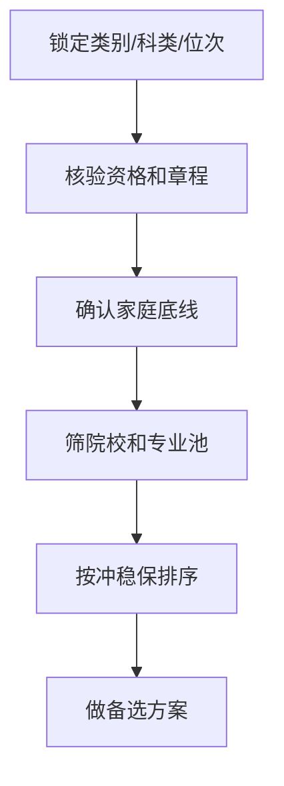
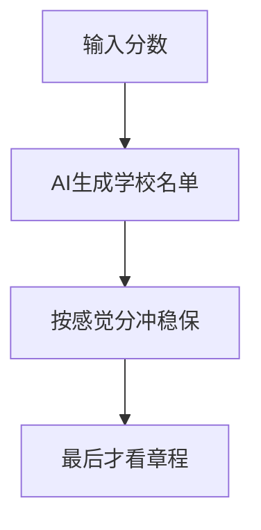

# 第三章：冲稳保不是万能药

本章结论：**冲稳保只是排序方法，不是风险控制系统。真正的风险控制，要先排红线、资格和数据，再谈冲稳保比例。**

家长最爱问：“冲几个、稳几个、保几个？”

这个问题有用，但不是第一个问题。

如果类别错了，冲稳保没意义。

如果章程限制没看，冲稳保没意义。

如果全靠去年分数线，冲稳保只是心理安慰。

如果冲进去后调剂到完全不能接受的专业，所谓“冲成功”也可能变成后悔。

## 1. 冲稳保到底是什么

冲稳保的本质是把志愿按风险从高到低排列。

- 冲：有机会，但不确定性高。
- 稳：匹配度较高，风险相对可控。
- 保：用于兜底，优先保证不滑档。
- 垫：更保守的安全位，防止极端情况。

它解决的是“顺序和梯度”问题。

它不解决“资格是否符合”问题。

## 2. 家长对冲稳保最大的误解

### 误解一：比例固定

不存在万能比例。

冲稳保比例取决于孩子位次、批次、可接受专业范围、家庭风险承受、是否有明确底线。

一个专业执念很强的孩子，不能和“学校优先、专业可调”的孩子用同一套比例。

### 误解二：冲就是冲学校

冲学校不等于冲好结果。

如果冲进学校后只能去完全不接受的专业，结果未必好。

要问的是：冲进去以后的最差专业，孩子能不能接受。

### 误解三：保底就是随便放几个低学校

保底不是“低分学校随便填”。

保底也要看专业、城市、学费、就业、升学、家庭接受度。

一个孩子绝对不能接受的保底学校，不是真保底，只是表格里的占位。

## 3. 先做风险体检，再排梯度

正确顺序：

错误顺序：

错误顺序看着快，实际上最容易在最后一天爆雷。

## 4. 冲的前提

可以冲，但要满足四个条件：

1. 资格确定符合。
2. 数据上不是纯幻想。
3. 进档后的专业结果能接受。
4. 失败后有稳和保接住。

少一个，就不是“冲”，是赌。

## 5. 稳的标准

稳不是“去年分数够”。

稳至少要看：

- 对应类别和科类的近年位次。
- 招生计划是否明显变化。
- 目标专业是否热门或收分波动大。
- 是否存在章程限制。
- 家庭是否接受该校该专业的现实结果。

稳的核心不是好听，而是可解释。

你要能说清楚为什么它稳。

## 6. 保的底线

保底要解决最坏情况。

一个合格保底至少满足：

- 录取概率相对高。
- 专业或专业范围能接受。
- 学费和地域能接受。
- 不会因为资格问题出错。
- 家庭提前知道这是兜底，不是失败羞辱。

很多家庭不愿认真做保底，因为觉得“不吉利”。

这是危险心理。

保底不是认输，是给孩子留路。

## 7. 冲稳保表格

| 层级 | 学校/专业 | 数据依据 | 最坏结果 | 能否接受 | 需要复核 |
|---|---|---|---|---|---|
| 冲 |  |  |  |  |  |
| 稳 |  |  |  |  |  |
| 保 |  |  |  |  |  |
| 垫 |  |  |  |  |  |

如果“最坏结果”这一列写不出来，就不要急着提交。

## 本章自查

- [ ] 我有没有先排红线，再排冲稳保？
- [ ] 每个冲的志愿，最坏专业能不能接受？
- [ ] 保底是不是全家都认可的真保底？
- [ ] 稳的依据是不是位次和计划，不是去年分数？
- [ ] 是否准备了方案 B？
