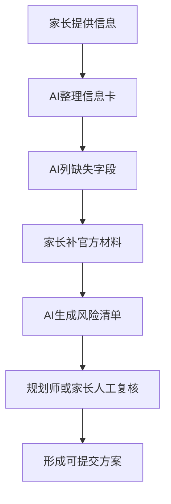

# 第五章：AI 能帮你什么，不能替你做什么

本章结论：**AI 是整理材料的助手，不是替家庭承担后果的裁判。用 AI 查漏可以，用 AI 拍板危险。**

现在很多家长会把分数、位次、想去的城市丢给 AI，让它生成志愿表。

这一步可以作为初筛，但不能作为最终方案。

原因不复杂：AI 不承担录取后果，家长承担。

## 1. AI 最适合做什么

### 整理信息

AI 可以把家长零散描述整理成结构化信息卡。

比如：类别、科类、分数、位次、目标城市、专业偏好、排除专业、特殊资格、风险承受。

### 查漏

AI 可以提醒家长还缺哪些信息。

比如：没有位次、没有类别、没有招生章程、没有体检结论、没有明确调剂底线。

### 生成核验清单

AI 可以帮你列出要查的材料：官方成绩/位次截图、招生计划、招生章程、一分一段公开表、近年录取数据、专项资格通知。

### 解释复杂概念

AI 可以把“平行志愿”“位次”“服从调剂”“院校专业组”“等级赋分”翻译成家长能理解的话。

### 生成初步方案

AI 可以基于你提供的数据生成初稿，供人工复核。

注意，是初稿。

## 2. AI 不适合做什么

### 不适合编数据

如果你没给官方数据，AI 可能会补全一个看起来像真的答案。

这不是能力，是风险。

### 不适合替你判断资格

体检、政审、单科、语种、专项资格，必须回到官方文件和学校章程。

AI 可以提示你查，不能替官方确认。

### 不适合替家庭做取舍

孩子能不能接受出疆，家长能不能接受调剂到冷门专业，家庭能不能承担民办学费，这些不是算法问题。

这是家庭决策。

### 不适合给强承诺

任何“稳上”“必录”“放心填”的 AI 结论，都要降级处理。

你需要的是证据，不是安慰。

## 3. 正确的 AI 使用流程



不要跳过 D 和 F。

这两个环节才是真正决定风险的地方。

## 4. 给 AI 的安全提示词

你可以这样问 AI：

```text
请不要直接推荐学校。先根据我提供的信息，列出志愿填报前必须核验的字段。凡是信息不足的地方，只标注“需补充”，不要给强结论。
```

你也可以这样问：

```text
请把这份志愿草表做风险体检，按红线、高风险、中风险、低风险分层。重点检查类别、科类、位次、招生章程、体检限制、单科要求、外语语种、服从调剂和备选方案。没有证据的地方标注“需人工复核”。
```

不要这样问：

```text
我家孩子 XXX 分，帮我直接填一份最稳的志愿表。
```

这个问法会诱导 AI 给你一个看似完整、实际缺证据的答案。

## 5. AI 输出要分级

AI 输出分三种：

| 类型 | 能不能直接用 | 处理方式 |
|---|---|---|
| 材料整理 | 可以作为草稿 | 人工核对字段 |
| 风险提示 | 可以参考 | 回到官方文件验证 |
| 最终方案 | 不能直接用 | 必须人工复核和家长确认 |

家长要记住：AI 不是不能用，AI 是不能越权用。

## 6. 问路工作台的原则

如果把 AI 放进专业服务里，最稳的结构不是“AI 推荐学校”，而是“AI 做风险体检”。

正确分工：

- AI：整理信息、发现缺口、生成草案、解释概念。
- 规则引擎：判断硬性条件，如类别、体检、选科、单科、语种。
- 规划师：复核风险、解释取舍、给出建议。
- 家长和考生：最终确认和签字。

这才是可靠路径。

## 本章自查

- [ ] 我有没有让 AI 直接拍板？
- [ ] AI 输出的数据是否能追溯到官方来源？
- [ ] AI 是否标注了信息不足的地方？
- [ ] 体检、章程、专项资格是否人工复核？
- [ ] 家庭取舍是否由人来决定？
