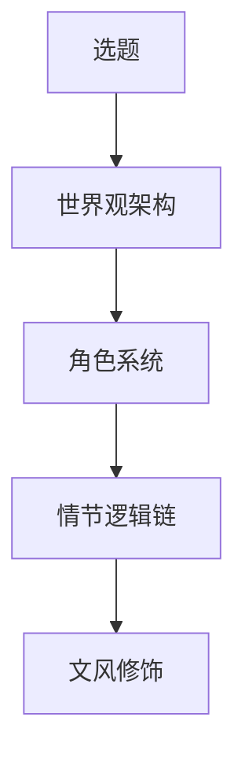
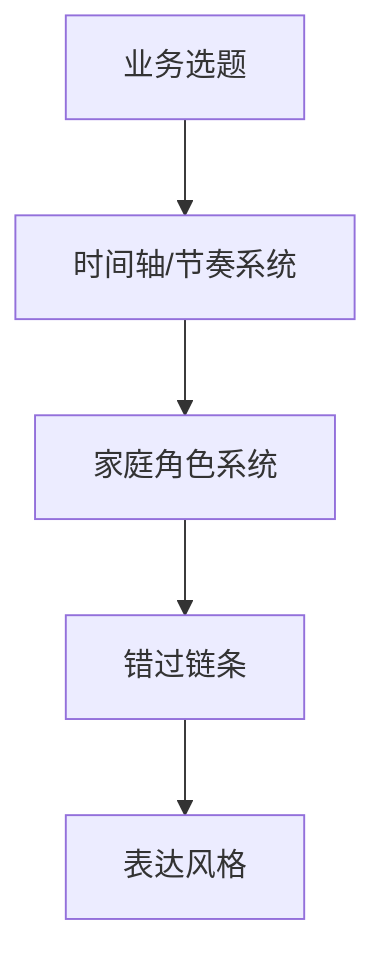

# 从《迟到》创作流程抽取到本书的方法（第二本 · 三年规划书版）

来源文件：`D:\AIProjects\Downloads\手机库下载\《迟到》创作全流程解析.md`
姊妹方法：第一本《别把孩子的分数浪费在志愿表里》`00_创作方法抽取.md`

## 原方法的核心

《迟到》方法文件给出的不是「写作技巧」，而是一个创作工程模型：

第一本把它改写为「业务选题→规则系统→用户场景→风险链条→表达风格」。本书是同一血缘的第二棒，但把组织主线从「填报当下的规则」换成「三年长跑的节奏」，因此五层做对应改写：

## 本书的五层结构

| 原模型 | 第一本对应 | 本书对应 | 执行要求 |
|---|---|---|---|
| 选题 | 志愿风险识别 | 三年升学节奏规划 | 先解决「别错过、别犯不可逆错」，不写「保名校」教程，不替代一对一 |
| 世界观架构 | 志愿填报规则系统 | 时间轴 / 节奏系统 | 七个学期段为脊柱；叠加 5 个不可逆决策里程碑；选科/资格/批次/户籍学籍年限以官方当年发布为准并标「需复核」 |
| 角色系统 | 家长/学生/规划师/AI/官方 | 家庭角色系统 | 父母分工、孩子参与、规划师复核、AI 不拍板、官方文件优先；横切两条能力层（信息系统、亲子沟通分工） |
| 情节逻辑链 | 错误如何发生 | 错过链条 | 起步晚/信息盲 → 选科锁死专业·资格错过·户籍学籍年限不够·方向错配 → 节奏崩盘 → 出分被动接盘；区分「可补救的遗憾 vs 不可逆的错过」 |
| 文风修饰 | Rex 式直白判断 | 表达风格 | 短句、清单、卡片、里程碑、红线；击穿「孩子才高一还早」的拖延心理，不写鸡血 |

## 不可逆决策里程碑（贯穿副线）

本书把「错过链条」翻译成 5 个有截止线的不可逆里程碑，作为时间轴各学期的强绑定锚点：

1. 选科定科（3+1+2，最大不可逆点）
2. 方向倒推（生涯/专业方向先于学校）
3. 特殊招生路线分流（强基/竞赛/艺体/军警/医学/公费师范/南疆专项/预科/综评）
4. 身体条件与资格资质早筛（一票否决项前置，含户籍/学籍年限）
5. 目标院校梯度初定（交棒志愿季的输入）

**里程碑 3「路线分流」内部三者时间窗必须各自显化、不可打包**：

- 竞赛：初赛报名/省队选拔有固定窗口，且需高一就启动持续学科积累。
- 强基计划：高三集中报名，但入围依赖高一高二的学科成绩与积累。
- 综合评价：三年的社会实践/获奖/材料持续积累，高一不动手高三补不回。

三者的关键时间窗在第 1 章里程碑地图各自单列标注（均标「需复核：以当年官方发布为准」），避免家长把「路线分流」误当成高二一次性决策。

每个里程碑统一写成「四件套」微结构：**时间窗 + 前置准备 + 一次家庭决策 + 一份留痕**，作为各学期「必做事项」的标准颗粒度。

## 信息系统三级标注（贯穿副线）

把信源分三级，作为全书一条副线工具并入附录与各章，强化第一本「官方优先」规则：

- **官方**：新疆教育考试院、招生高校官网、官方体检指导意见等——可作判断依据。
- **需复核**：政策、选科要求、资格门槛、户籍学籍年限、时间节点等会随年份变化的——一律标注「需复核（以当年官方发布为准）」。
- **小道消息**：群聊截图、短视频、AI 生成未核实内容——不得作为长期决策依据。

## 时间分配

沿用源文件与第一本的比例：

- 基础研究 45%：官方政策、选科与专业限制、体检限报、户籍学籍年限、特殊招生资格、各学期真实窗口与节点。
- 系统思考 35%：时间轴节奏模型、不可逆里程碑分层、家庭角色与横切能力、问路工作台可复用结构。
- 文字产出 10%：章节初稿、卡片、清单、合成案例。
- 格式处理 10%：Markdown、PDF、网页、开源仓库结构。

## AI 边界

AI 可以做：

- 把官方材料整理成时间轴/对照卡/清单。
- 发现字段缺失、提示哪些项「需复核」。
- 生成家长能看懂的解释稿、多版本标题与目录、章节初稿。

AI 不该做：

- 替家庭决定选哪三科、走哪条特殊路线、要不要复读/转轨。
- 替官方文件背书，把会过期的政策写成确定结论。
- 在信息缺失时给强结论，或把未核验的预测写成事实。

## 本书第一质检

1. 家长看完是否能立刻定位「现在在哪一段、本学期必做什么、过期补不回的是什么」。
2. 每个判断是否有可核验来源或明确标注「需复核」。
3. 内容是否服务业务闭环：公域信任、模板承接、私域咨询、一对一筛选，并向第一本导流。
4. **强自检红线**：若一个家庭照书就能产出无需任何人工复核的最终三年方案，就是写过头了，必须收回到框架层。需要一人一策处一律标「此处建议人工复核」并指向咨询入口。
