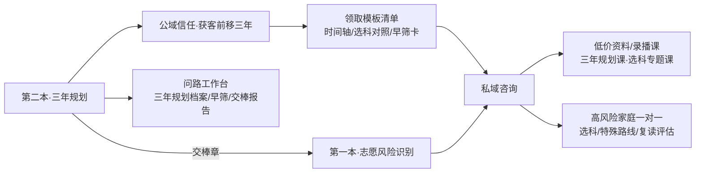

# 选题策划（第二本）

## 结论

第二本开源书选：**《别等出分才开始：新疆高中家庭三年升学规划手册（初升高—高三 · 3+1+2）》**。

第一本是「出分后填报当下」的被动风险识别；第二本是「高中三年」的主动规划。原因很直接：把获客窗口从志愿季那几天前移到高一甚至初升高，能拉长用户生命周期，比第一本更早建立信任，并天然向第一本导流，形成三年期的信任与变现链路。

组织主线采用评审冠军【时间轴】，并嫁接「决策里程碑/错过链条/家庭能力系统/路径分流」四个候选方案的亮点（详见 00 与 README）。

## 候选选题池中的定位

| 选题 | 价值 | 致命问题 | 处理 |
|---|---|---|---|
| 新疆家长志愿风险识别手册（第一本） | 强获客、强信任、低泄密 | 需持续官方复核 | 已成书 |
| **新疆高中家庭三年升学规划书（本书）** | 获客前移三年、用户生命周期最长、与第一本零重叠 | 学期窗口/选科/资格/户籍学籍年限需大量官方复核，且最易越界替代一对一 | 立即写 |
| 低分段孩子升学路径手册 | 用户痛点强 | 需更多真实路径数据、最接近一对一边界 | 降级为本书一章 + 附录早筛卡 |
| 问路工作台产品白皮书 | 塑造专业壁垒 | 家长不想看产品架构 | 内部文档，不公开 |
| 问分 AI 提分方法论 | 服务考前产品 | 与规划主线不同频 | 后置到考前内容季 |

## 目标读者

- 新疆初三升高一、高一、高二在读学生的家长，尤其信息焦虑、第一个孩子上高中、不知道「现在该做什么」的家庭。
- 成绩中段、最容易被「再等等看出分」拖过提前布局窗口的家庭（本书最大受众）。
- 有特殊路线可能性的家庭（物理/竞赛苗子、艺体生、想走军警/公安/医学/公费师范、南疆考生、少数民族预科适用家庭），需提前 2-3 年判断要不要走、能不能走。
- 涉及户籍/学籍迁移、或想走专项计划（农村/国家/南疆专项）的家庭，需尽早确认户籍与学籍年限是否够得上。
- 想用 AI 帮孩子做规划，但明白 AI 不能替家庭承担三年节奏与录取后果的家长。
- 计划复读或可能转轨（普高转职教/留学/艺体）的家庭，需提前留好 PlanB。

## 本书不服务谁

- 想买「三年保上 985/211 路线」的家庭——本书不承诺结果，只降低错过与不可逆。
- 不愿如实面对孩子真实成绩、身体条件、家庭预算，却要一个漂亮规划的人。
- 想让 AI/本书直接代替选科决定、特殊招生报名决定、复读决定的人。
- 孩子已出分、只剩填报这几天的家庭——那是第一本的场景，本书帮不上当下，应直接交棒。
- 把「规划」理解成给孩子加满补习班、用焦虑驱动的家庭——本书讲节奏与取舍，不卖鸡血。

## 核心承诺

读完这本书，家长不一定能独立做出最优三年方案，但应该能做到四件事：

1. 拿到一张「新疆高中三年关键窗口时间轴」，知道每个学期必做的 1-3 件事、哪些事过了这学期就补不回来。
2. 看懂高中三年只有 5 个「做错回不了头」的不可逆里程碑（尤其选科定科），并理解「路线分流」里竞赛/强基/综评各自的时间窗不同、不能等到高二一次性决定。
3. 完成几项关键早筛（身体条件、资格资质、户籍/学籍年限、选科可行域），知道哪些必须找官方/专业人士复核。
4. 在出分前就准备好交棒：带着干净的资格、对的选科、齐全的材料和家庭共识，顺畅接入第一本的志愿填报流程。

## 与第一本及业务闭环的关系

战略价值：本书在高一高二蓄水并筛选，到高三志愿季用第一本承接同一批家庭，复用「问路工作台」的风险区/复核区/交付报告结构。所有需要个性化的环节都指向同一咨询入口，不在书内闭合。

## 与第一本的区隔原则（防重叠）

本书与第一本在专业/路线清单上必然有交集（特殊路线、体检限报、复读），区隔靠「时态」切干净：

- 第二本 = 提前自查（能不能走、值不值得走、来不来得及）。
- 第一本 = 当下逐条核验（能不能报、怎么填、章程/政审/体测达标标准）。

凡进入逐条核验、章程逐条、政审/体测达标标准、出分后该不该复读，本书一律一句话交棒第一本对应章，不展开。

## 书名与副标题确认

- 主标题保留 **《别等出分才开始》**，与第一本《别把孩子的分数浪费在志愿表里》构成「别…」对仗书系。
- 副标题确认为 **「新疆高中家庭三年升学规划手册（初升高—高三 · 3+1+2）」**：「手册」二字与第一本统一；显式标注年级段，便于书店/电商按年级搜索；植入「3+1+2」关键词，便于公域/电商按新高考检索。
- 封面建议加横幅：**「读完它，再读《别把孩子的分数浪费在志愿表里》」**，明确产品线先后。
