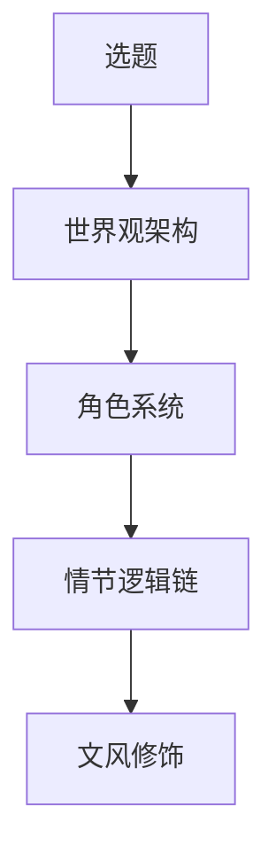
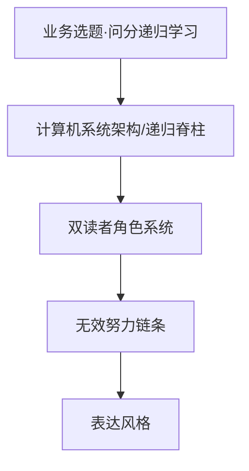

# 从《迟到》创作流程抽取到本书的方法（第三本 · 问分递归学习方法论版）

来源文件：`D:\AIProjects\Downloads\手机库下载\《迟到》创作全流程解析.md`
姊妹方法：第一本《别把孩子的分数浪费在志愿表里》`00_创作方法抽取.md`、第二本《别等出分才开始》`00_创作方法抽取.md`

## 原方法的核心

《迟到》方法文件给出的不是「写作技巧」，而是一个创作工程模型：

第一本把它改写为「业务选题→规则系统→用户场景→风险链条→表达风格」；第二本改写为「业务选题→时间轴节奏系统→家庭角色系统→错过链条→表达风格」。本书是同一血缘的第三棒，处在产品线最前端（平时学习/提分），把组织主线从「填报当下的规则」「三年长跑的节奏」换成「一台可自我编程的计算机系统」，五层做对应改写：

## 本书的五层结构

| 原模型 | 第一本对应 | 第二本对应 | 本书对应 | 执行要求 |
|---|---|---|---|---|
| 选题 | 志愿风险识别 | 三年节奏规划 | 问分·递归学习方法论 | 先解决「怎么学」这件最前端的事；提分是方法跑通的结果不是承诺；不替代问分付费的个性化诊断/教练 |
| 世界观架构 | 填报规则系统 | 时间轴/节奏系统 | 计算机系统架构 + 递归脊柱 | 七环节系统模型（输入/编译/存储/调度/执行/调试/迭代）为骨架；递归五机制（拆子问题/base case/自引用/回溯迭代/收敛判据）为显式命名的脊柱层 |
| 角色系统 | 家长/学生/规划师/AI/官方 | 家庭角色系统 | 双读者角色系统 | 考生＝自己编程的那台机器，能上手用；家长＝供电与散热（运维环境），看懂并支持不超频；AI＝副驾不拍板；问分＝持续诊断与陪跑 |
| 情节逻辑链 | 错误如何发生 | 错过链条 | 无效努力链条 | 把时间当学会的死循环 → 没 base case 的栈溢出/空转 → 看懂≠会用/背了就忘/错题反复错 → 无反馈无收敛 → 努力很多分不涨；区分「真在学 vs 感动自己」 |
| 文风修饰 | Rex 式直白判断 | Rex 式直白判断 | Rex 式直白判断 | 短句、清单、卡片、对照表；结论先行；不写鸡汤大词；每个比喻必落到一个当天可做的动作 |

## 递归脊柱：把「递归」从隐线变成明写的脊柱

本书最大的风险是「递归被计算机系统隐喻稀释成装饰」。解法：在「七环节系统模型」之下，显式命名一层「递归五机制」作为脊柱，让四处章节硬承接递归（**总览章只锚定、不展开，方法落在各承接章**）：

1. **拆解为子问题**（第2章）——把「这块不会」切到能动手为止。
2. **base case / 最小可做单元**（第2章）——能不查任何资料独立做对的最小单元＝触底；没有 base case 的递归会栈溢出，对应「假装在学其实卡死/空转」。
3. **自引用 / 自我调用**（第4章调试章承接）——错题不是用来改的，是用来喂下一轮的；用上一轮结论作为下一轮输入。
4. **回溯与迭代**（第7章版本迭代）——做错时回退到最近一个做对的节点，而非从头重来。
5. **收敛判据**（第7章 + 考前承接）——连续 N 次独立做对／能讲给别人听懂＝该停；替代「刷到考试为止」的无限投入。

最高层递归是第8章「自举与元认知」：用同一套方法去调试「我学习的方法」本身。全书读法本身就是「用这套方法去学这套方法」的一次自我调用——让读者在读的过程中经历一遍递归，而不是被告知「递归很重要」。

## 三层落法纪律（防生搬硬凑的强制质检）

每个计算机/递归概念，绝不停在比喻，强制走三层：

1. **先回答「它对应学习里哪个真实困境」**——调试＝错题反复错却不知错在哪；编译＝一看就会一做就废；缓存＝背了就忘/考场提取不出；调度＝时间花了分没涨。隐喻只是更准的命名，不是装饰。
2. **再给隐喻**——把那个真实困境用计算机概念重新命名，让读者获得一个可定位的坐标。
3. **再落一个当天可做的动作或一张卡**——拆解卡/错题归因四分法/提取练习/更新日志/元认知三问。凡只能讲概念、讲不出动作的隐喻一律砍掉。

**附录 A「计算机概念→学习动作→留痕」三列对照总表，是全书反术语堆砌的总锚，且必须先于各章写。** 硬纪律：该表「学习动作」列每一行必须是**动词开头的当天可做动作**（写/默/讲/拆/标/勾）；凡填不出具体动作的那一行，对应的计算机概念就从全书删除——用这张表反向裁掉撑不起动作的装饰性比喻（编译/缓存/调度/调试能落动作就留；若 Codex 顺手带出寄存器/中断向量/指针这类二级术语却落不出当天动作，一律砍）。

## 双读者：给家长一条独立阅读路径 + 每章家长段写死成话术微结构

审校点名：考生侧厚、家长侧薄，且各章末「给家长一段」最易退化成「多鼓励少施压」式鸡汤（正是主编点名的空话坑）。本书的纪律：

1. **前言显式给家长一条独立最短阅读路径**——「你可以只读前言＋第9章＋各章末『给家长段』」，不逼家长啃完计算机隐喻。
2. **各章末「给家长段」写死成同一张微结构**：`这一环家长能观察到的信号（如孩子做题卡住时的具体表现）＋ 一句该说的话 ＋ 一句别说的话`，全部具体到可照说的话术；**禁止出现「理解孩子／营造氛围／多鼓励」类抽象词**。
3. 第9章整章写给家长，把系统隐喻翻成「供电与散热，不超频」的运维语言，话术替换覆盖到每一环而非给一两句样板。

## 时间分配

沿用源文件与前两本的比例，换成本书工作量：

- 基础研究 45%：可公开的学习科学原理（主动提取、间隔重复、元认知、提取失败 vs 编码失败）、计算机系统概念的准确对应、真实学习痛点场景采集。
- 系统思考 35%：七环节系统模型、递归五机制脊柱、双读者角色与运维隐喻、防泄密边界设计、与问分付费产品的接口划分。
- 文字产出 10%：章节初稿、卡片、清单、合成示例。
- 格式处理 10%：Markdown、PDF、网页、开源仓库结构。

## AI 边界

AI 可以做：

- 把知识点整理成卡片、对照表、清单，帮做查漏。
- 陪练复现一个 bug、生成变式题、解释一个概念。
- 帮考生做「错题属于哪一类粗归因」的整理。

AI 不该做：

- 替考生跑学习循环、替考生思考、替考生做诊断决策。
- 把「精准定位某个学生某科的真实根因、给定制纠偏路径」做出来——这是**问分付费产品的个性化诊断/教练能力**，书只给框架，AI 只整理查漏不拍板，个性化诊断与持续陪跑一律指向问分。
- 沿用第一本「AI 副驾、不拍板」原则，给「安全提示词 vs 危险提示词」对照，划清「AI 能做调试辅助」与「个性化诊断指向问分」的边界。

## 本书第一质检（含防写空 / 防泄密）

1. **防写空（方法论书第一坑）**：每一章是否落到至少一个「当天就能做的动作或一张可填卡」？凡只讲「编译很重要」「要调试自己」却给不出动作的，即为退化成鸡汤，必须重写或砍掉。逐章用「这个比喻能不能落到一个真实学习动作」质检。**第1章总览章是最易写成名词展览的高危处：本章禁止展开任何一个机制的方法（方法留各章），删掉所有形容词后必须仍是一份能勾选的体检表。**
2. **防生搬硬凑**：每个计算机/递归概念是否先回答了「对应哪个真实学习困境」？没有真实困境作锚的比喻，就是炫技空话，删。**第6章进程调度是最易停在炫技的处：CPU/上下文切换比喻必须落到「一个番茄钟内被自己中断几次划一笔正字」这种糙而可做的动作，落不到就砍掉 CPU 比喻直接讲「一次只做一件事＋先修最常错的」。**
3. **防标题党**：反常识书名/章节钩子的主张，是否与正文方法严格对应（如「别刷题去调试」对应错题分层调试、「会收敛」对应收敛判据）？耸动而脱节即标题党，禁。**逐章核验迷思与方法咬合：第8章迷思由「越聪明越好/天赋决定一切」改为「学会了就不用管怎么学了」，直接对应元认知/学习如何学习。**
4. **防泄密（强自检红线·本书最高危）**：若某章已能让学生照抄出一套**无需任何外部诊断就能持续自我升级的完整闭环**，就是写过头了，必须收回到「框架 + 单次动作 + 自查 + 持续诊断陪跑找问分」层。两处最危险，输出边界写成硬上限而非提示：
   - **第4章（调试·错题归因）**：四分法只保留「四类标签的定义＋一句话识别问句」，每类「修法方向」收窄到**一句话通用原则**（如记错→去查它该长什么样再重背），**严禁出现「如果是 X 且 Y 则用 Z 修法」的二级分支**；那个完整调试示例改成**只演示归因到四类标签为止，到精准根因（为什么这一步会崩）显式断在此处，标注精准根因定位指向问分**。
   - **第8章（自举·元认知）**：五阶段刻度只作「自测我现在在哪档」的**静态标尺**（每档给 1 个识别信号），**删掉「如何从这档升到下一档」的任何路径化指引——升级路径正是问分陪跑内核**；元认知三问保留为「自检问句」、不配「问出答案后该怎么调的决策树」；合成示例只演示「学生发现一个 bug」，到「持续按周纠偏到收敛」显式断开指向问分。
5. **业务闭环**：内容是否服务「开源书（公开框架＋自学起步＋为什么）→公域信任→私域→问分付费（个性化诊断＋教练＋陪跑＋完整执行系统）」，并向第二本《别等出分才开始》交棒。
