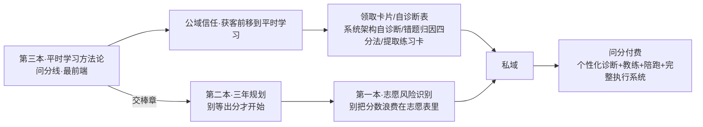

# 选题策划（第三本）

## 结论

第三本开源书选：**问分线·递归学习方法论**，建议主标题 **《别刷题，去调试》**，副标题 **「把学习当成一台你能自己调试的计算机：一套平时就能用的递归学习方法」**。

它本质不是「考前提分技巧书」，而是**一套平时的学习方法论**——教考生像调试一台计算机系统一样调试自己的学习过程，**提分是这套方法跑通后的自然输出，不是靠刷题堆出来的承诺。** 它处在产品线最前端（平时怎么学），往后接第二本（三年怎么规划）、第一本（出分后志愿怎么填）。

组织主线采用评审冠军【计算机系统隐喻】，以「七环节系统模型」为骨架、「递归五机制」为显式脊柱，并嫁接四个候选方案的亮点（详见 00 与 README）。

## 候选选题池中的定位

| 选题 | 价值 | 致命问题 | 处理 |
|---|---|---|---|
| 第一本·志愿风险识别 | 强获客、强信任、低泄密 | 需持续官方复核 | 已成书 |
| 第二本·三年规划 | 获客前移三年、生命周期最长 | 大量官方复核、最易越界 | 已成书 |
| **第三本·递归学习方法论（本书）** | 获客前移到平时学习、largely 普适、可分享钩子最锋利 | 最易写空成鸡汤、最易把问分诊断内核倒出 | 立即写 |
| 纯应试刷题技巧合集 | 看似直接 | 与「方法论」内核不同频、易沦为题海 | 不做 |
| 问分产品白皮书 | 塑造壁垒 | 家长/考生不想看产品架构 | 内部文档，不公开 |

## 目标读者（家长 + 考生双读者）

考生本人能自己上手用，家长能看懂并支持、不添乱——两者都要照顾。**双读者纪律见 00 与 README：前言给家长独立阅读路径，各章末家长段写死成「信号＋该说的话＋别说的话」话术微结构，禁抽象词。**

**考生侧：**

- 高中考生本人，尤其中段、努力但不提分、刷题多却卡分、错题反复错的「假勤奋」型——能照书自己跑一遍方法。
- 「学了就忘、考场上提取不出来」的提取失败型学习者。
- 时间投入很多但分数停滞、怀疑自己「不是学习的料」的学生（本书核心要拆掉的就是这个归因）。
- 看过太多「成长型思维」鸡汤、想要能落地动作而非口号的人。

**家长侧：**

- 想支持孩子、但容易用「多刷题／熬时间／比时长」式施压的家长——需要看懂这套方法在干什么，从而承担「供电与散热」（运维）角色而非「超频」。
- 已读过第二本（规划）、第一本（志愿）的家庭，现在缺「平时到底怎么学」这块最前端拼图。
- **家长是双读者之一，所以书名必须家长也能看懂**：避免把对非技术家长几乎不可解的术语（如「编译」「U 盘」做正式书名），否则获客漏掉一半人。

背景沿用新疆/新高考家庭，但**「学习方法论」本身 largely 普适，不做过度本地化，不写成新疆专属、不绑死本地政策。**

## 本书不服务谁

- 想要「一套照抄就提分的标准答案/速成押题」的人——本书不承诺名次，只教方法。
- 不愿面对自己真实错题与盲区、只想被安慰的人。
- 想让 AI 或本书直接代替自己思考与练习的人。
- 想要「针对你这个孩子的精准诊断、持续陪跑纠偏」的家庭——那是问分的活，本书交棒。

## 核心承诺

读完这本书，读者不一定能独立做出最优学习系统，但应该能做到四件事：

1. 给自己的学习画出一张「系统架构图」，当场定位自己卡在输入、编译、存储、调度、执行、调试、迭代哪一环，不再笼统地骂自己「不够努力／不是学习的料」。
2. 学会把错题当 bug 调试而非罚抄：用「看错/不懂/记错/没时间」四类标签给每道错题做粗归因，知道这一类错的通用修法原则；**精准根因（为什么这一步会崩）与定制纠偏指向问分。**
3. 掌握三件当天能上手的核心动作——把不会的题递归拆到 base case、用主动提取＋间隔重复把知识搬进可提取的缓存、每周写一份学习方法的更新日志。
4. 建立元认知/自举习惯：能用静态标尺自测自己在哪一档、能用元认知三问自检，知道哪些卡点靠自己迭代两三轮就能修、哪些需要找问分做个性化诊断与持续纠偏。

家长侧额外承诺：看懂孩子在做的这套方法，知道怎么当「运维环境」去支持而不添乱，把「你怎么又错」换成「这道题 bug 定位到哪一步」。

## 与前两本及问分产品的关系与不泄密边界

三本构成「问分→问路」的递进信任链：先用平时学习把分数跑起来（本书），再用三年节奏把布局做对（第二本），最后用志愿把分数兑现（第一本）。

**业务闭环：** 开源书（公开方法框架＋自学起步＋为什么）→公域信任→私域→问分付费（个性化诊断＋教练＋陪跑＋完整执行系统）。

**不泄密边界（与前两本「不替代一对一」同构）：** 本书给三层公开安全层——①可公开的方法框架（七环节系统模型＋每章一个通用动作＋递归五机制）；②自学起步（让读者自己把系统跑起来的卡片与自查表）；③为什么（每个方法背后的认知原理）。守住不外泄的问分付费内核是：**个性化诊断**（书只教自己做错题/状态的粗归因＝四类标签＋一句话识别，精准定位某学生某科真实根因留问分）、**教练/陪跑**（书是一次性自启动指引，持续监控、按周纠偏、陪你迭代到收敛是问分的活；尤其「如何从某一档升到下一档」的升级路径＝陪跑内核，不写）、**完整执行系统与最深专有机制**（不写问分内部的诊断量表、参数、评分逻辑、迭代算法，一律留「此处可由问分做个性化升级」的钩子，由主编/产品后补，架构师不编造专有深度）。

**两处最高危，输出边界写成硬上限：**

- **第4章错题归因四分法（最高危）**：对齐第一本「家长信息采集卡只给空白框架不给结论」。四分法只给「四类标签＋一句话识别问句＋一句通用原则」，**严禁二级修法分支与完整反推根因示例**；调试示例只演示到归因为四类标签，精准根因显式断点指向问分。否则附录 E 一张卡就把诊断产品免费倒出。
- **第8章自举元认知（次高危）**：五阶段只做静态自测标尺（每档一个识别信号），**删掉任何升级路径化指引**；元认知三问只做自检问句、不配决策树；合成示例只演示「发现一个 bug」，持续按周纠偏到收敛显式断开指向问分。

第4、7、8、10、11 章在涉及个性化处留钩子不展开。

## 与前两本的区隔原则（防重叠）

本书与前两本话题几乎不交集（前两本是规划/志愿，本书是平时学习方法），区隔天然清晰。唯一衔接是**交棒章**：本书只管「平时怎么学」，凡进入「三年怎么规划」一句话交棒第二本，凡进入「出分后志愿怎么填」一句话交棒第一本，不在本书展开。

## 书名候选与建议发布名

延续「别…」对仗书系（别把分数浪费、别等出分、别刷题），主编要「特别、反常识、但不标题党」。

- **建议发布名：《别刷题，去调试》**，副标题「把学习当成一台你能自己调试的计算机：一套平时就能用的递归学习方法」。理由：与书系对仗最强、最锋利、反「刷得多就提分」的全民信仰；「刷题」是家长也懂的全民共识，够反常识；「调试」与正文「把错题当 bug 调试」严格对应，不脱节；**且家长这一双读者也能看懂。**
- 分享钩子/副标题级文案：**《错题不是用来改的，是用来喂下一轮的》**——与自引用机制严丝合缝，但太长不适合做正式书名，留作社群传播钩子。
- 降级为章节标题/社群文案（不做正式书名）：《先把自己编译通过》《别把脑子当 U 盘用》对非技术家长几乎不可解，做正式书名会漏掉一半受众；《你不需要更努力，需要会收敛》中「收敛」超出家长词汇，降级为第7章章节钩子。
- 封面建议加横幅：**「跑通它，再读《别等出分才开始》」**，明确产品线先后。
