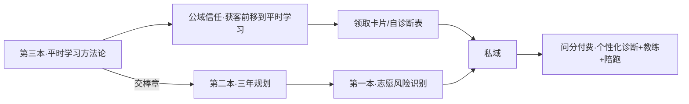

# 别刷题，去调试（第三本 · 问分线·平时学习方法论）

暂定书名：**别刷题，去调试：把学习当成一台你能自己调试的计算机——一套平时就能用的递归学习方法**

作者：黄昊 Rex / 问路·问分

## 定位

面向高中考生本人 + 家长的开源「平时学习方法论」书。它不承诺名次，不替代问分的个性化诊断与陪跑；它只解决一个更前端的问题——**教你像调试一台计算机系统一样调试自己的学习过程**：把不会的题递归拆到 base case，把错题当 bug 调试而非罚抄，把背了就忘当缓存/提取问题处理，把复盘升级成给学习方法发版本号，最终让方法本身自我进化（元认知/自举）。**提分是这套方法跑通后的自然输出，不是靠刷题堆出来的承诺。**

这是「问路·问分」业务型开源书系的第三本，处在产品线最前端：**第三本在最前（平时怎么学），往后接第二本（三年怎么规划），再接第一本（出分后志愿怎么填）。**

## 为什么选这个题

前两本把获客窗口卡在「高三志愿季」和「高一三年规划」。本书把它前移到「平时学习」这件每天都在发生的事，受众最大、痛点最普遍（努力但不提分、刷题多却卡分、错题反复错、背了就忘），分享/搜索钩子最锋利（「别刷题去调试」「错题不是用来改的，是用来喂下一轮的」「一看就会一做就废」），且天然向第二本、第一本导流。

- 免费价值：让考生立刻给自己的学习画出一张系统架构图，定位卡在哪一环，并拿到当天能上手的核心动作。
- 商业边界：只给通用方法框架、自学起步卡片、为什么有效；不替任何一个学生做精准根因诊断、定制纠偏、持续陪跑。
- 双读者：考生能自己上手用，家长能看懂并当「运维环境」支持而不超频。**家长有独立最短阅读路径（前言＋第9章＋各章末给家长段），不必啃完计算机隐喻。**

## 与前两本的关系

| 维度 | 第三本（本书） | 第二本《别等出分才开始》 | 第一本《别把孩子的分数浪费在志愿表里》 |
|---|---|---|---|
| 产品线位置 | 最前端·平时学习/提分 | 中段·三年规划 | 末端·志愿季风险识别 |
| 解决 | 平时怎么学 | 三年怎么规划 | 出分后志愿怎么填 |
| 主线隐喻 | 计算机系统/递归 | 学期时间轴/不可逆里程碑 | 志愿填报规则系统 |
| 结尾 | 交棒章：方法跑通后交给规划与志愿 | 交棒章：三年成果交给第一本 | 合格志愿方案长什么样 |

三本话题几乎不交集（本书是学习方法，前两本是规划/志愿），区隔天然清晰。唯一衔接是交棒章：本书只管「平时怎么学」，凡进入规划/志愿一句话交棒，不展开。书名延续「别…」对仗书系（别把分数浪费、别等出分、别刷题）。

## 书名说明（家长也是读者，书名必须家长能懂）

- **建议发布主名：《别刷题，去调试》**——「刷题」是家长也懂的全民共识、够反常识，「调试」与正文错题分层调试硬对应，不脱节，且双读者都能看懂。
- 分享钩子/副标题级文案：《错题不是用来改的，是用来喂下一轮的》（与自引用机制严丝合缝，但太长不做正式书名）。
- 不做正式书名（对非技术家长不可解，降级为章节标题/社群文案）：《先把自己编译通过》《别把脑子当 U 盘用》《你不需要更努力，需要会收敛》。

## 与问分付费产品的关系与不泄密原则

业务闭环：**开源书（公开方法框架＋自学起步＋为什么）→公域信任→私域→问分付费（个性化诊断＋教练＋陪跑＋完整执行系统）。**

不泄密原则（与前两本「不替代一对一」同构）：

1. 本书给三层公开安全层——可公开的方法框架、自学起步、为什么有效。
2. 守住不外泄的问分付费内核：**个性化诊断**（书只教自己做错题/状态的粗归因＝四类标签＋一句话识别，精准根因定位指向问分）、**教练/陪跑**（书是一次性自启动指引，持续监控按周纠偏陪你迭代指向问分；尤其「如何升档」的升级路径＝陪跑内核，不写）、**完整执行系统与最深专有机制**（不写诊断量表/参数/评分逻辑/迭代算法，留钩子由主编/产品后补，不编造专有深度）。
3. **强自检红线**：若某章已能让学生照抄出一套无需任何外部诊断就能持续自我升级的完整闭环，就是写过头，必须收回到框架层。**第4章（错题归因四分法）与第8章（自举·元认知）是最高危处，输出已写成硬上限**：第4章只给四类标签＋一句话识别＋一句通用原则、删二级修法分支与完整根因示例；第8章五阶段只做静态标尺、删升档路径。两章章末显式标注「公开安全层到此」。

## 文件清单

- [00_创作方法抽取.md](./00_创作方法抽取.md)
- [01_选题策划.md](./01_选题策划.md)
- [02_目录设计.md](./02_目录设计.md)
- [CODEX_执行指令.md](./CODEX_执行指令.md)
- [book.md](./book.md)
- [chapters/](./chapters/)
- [appendix/](./appendix/)

## 写作规则

沿用前两本基线 4 条：

1. 结论先行：每章开头先告诉读者「这章拆穿什么迷思 / 建起什么能力」。
2. 不写玄学：不用「押名校」「速成提分」「玄学记忆术」这类表达；提分是结果不是承诺。
3. 短句清单卡片：多用短句、清单、对照表、卡片；Rex 式直白判断，不写鸡汤大词。
4. AI 降级：AI 只做整理、查漏、陪练、生成练习，不替考生跑循环/思考/做诊断决策。

本书特有 4 条：

5. 三层落法纪律（防生搬硬凑）：每个计算机/递归概念必须先绑一个真实学习困境，再给隐喻，再落一个当天可做的动作或一张卡。落不到动作的比喻一律删；二级术语（寄存器/中断向量/指针）落不到附录 A 当天动作的一律砍。
6. 每章开场拆穿一个迷思：先拆穿一个主流学习迷思，再给递归解法；迷思与方法严格对应（防标题党，第8章迷思用「学会了就不用管怎么学了」）。
7. 递归脊柱显式：第2/4/7/8 章显式承接递归（拆子问题/base case、自引用、回溯与收敛、自举/元认知）；第1章总览章只锚定不展开。
8. 双读者：考生能自己上手，家长能看懂；前言给家长独立阅读路径，各章末家长段写成「信号＋该说的话＋别说的话」话术微结构（禁抽象词）；第9章整章写给家长，用「供电与散热，不超频」运维隐喻。

## 版权

默认采用 **CC BY-NC-SA 4.0**：允许非商业传播和改编，需署名并以相同方式共享。若后续决定做真正开放商业复用，可改为 CC BY 4.0。
